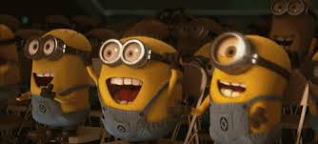

## பகுதி 1: ஆழக்கற்றல் தோற்றம்

## ஒளியும் உயிர்களின் தோற்றமும்

### பார்வை பரிணாமம்

சுமார்  ஐநூற்று ஐம்பது மில்லியன் வருடங்களுக்கு முன் **கேம்பிரியன் யுகத்தில்** (**Cambrian period**) பூமியின் வளி மண்டலத்தில் (atmosphere) சில மாற்றங்கள் ஏற்பட்டது. பூமியில் உள்ள உயிர்கள் ஒளியை உணர ஆரம்பித்தன.  நண்டு இனத்தைச் சேர்ந்த **ட்ரைலோபைட்** (**Trilobyte**) எனப்படும் ஒரு கடல் வாழ் உயிரிக்கு ஒளியை உணர்ந்து கொள்ளும் திறன் வந்தது என்கிறார்கள்.  பல்லுயிர் பெருக்கத்தால் (Biodiversity) பூமியில், உயிர்களின் உருவாக்கத்தில் ஒரு எழுச்சி ஏற்பட்டது.  இதனை **பார்வை எழுச்சிக் கோட்பாடு** (**Light Switch Theory**) என்றார் **ஆண்ரூ பார்கர்** (**Andrew Parker**) என்ற விஞ்ஞானி.

 

பார்வைத்திறன், நுகரும் திறனை விட வலிமையானது.  உணவைத்தேடவும், தொலை தூரத்திலிருந்து வருபவன் நண்பனா, எதிரியா என்பதைத் தெரிந்துகொள்ளவும் விலங்குகள் பார்வைத்திறனைக் கையாள ஆரம்பித்தன.  ஒளியை உயிர்கள் உணர ஆரம்பித்த பின் இரையும், இரையை வேட்டையாடும் உயிரினங்களும் போட்டி போட்டுக்கொண்டு அதிக எண்ணிக்கையில் உருவாகின.  இதையே **கேம்பிரியன் வெடிப்பு** (**Cambrian explosion**) என்றார்கள் விஞ்ஞானிகள்.

 

 
<table>
  <tr>
    <td align="center">ட்ரைலோபைட்</td>
    <td align="center">இமாச்சல பிரதேசத்தில் கண்டெடுத்த ட்ரைலோபைட் படிமம்</td>
    <td align="center">Meme</td>
  </tr>
  <tr>
    <td valign="center"></td>
    <td valign="center"></td>
    <td valign="center"></td>    
  </tr>
</table>
 

*"550 மில்லியன் ஆண்டுகளுக்கு முன்பு நமது கிரகத்தில் உள்ள உயிரினங்களின் எண்ணிக்கை வேகமாக அதிகரிக்கத் தொடங்கியது என்பதை வரைபடத்தில் கவனியுங்கள்.   கிடைமட்ட அச்சு (horizontal axis) காலத்தை குறிக்கிறது.  அதாவது, 550 மில்லியன் ஆண்டுகள் முதல் தற்போதைய காலம் வரை உள்ளது.  செங்குத்து அச்சு (vertical axis) உயிரினங்களின் எண்ணிக்கையைக் குறிக்கிறது"*
 

 
<table>
  <tr>
    <td align="center">வாத்தியார்</td>
    <td align="center">Number of species (Time vs Genera)</td>
  </tr>
  <tr>
    <td valign="center"></td>
    <td valign="center"></td>
  </tr>
</table>
 

**சார்லஸ் டார்வின்** (**Charles Darwin**) தனது **பரிணாமக் கொள்கையில்** (**Theory of Evolution**), விலங்குகளின் ஒளி உணர் திறனால் ஏற்பட்ட பல்லுயிர் பெருக்கத்தைப் பற்றிய ஆய்வுகளை கணக்கில் கொள்ளவில்லை.  அவர் தனது **இயற்கை தேர்வுக் கோட்பாடில்** (**Theory of Natural selection**) உயிர்களின் பரிணாம வளர்ச்சியில் இயற்கையின் பங்கு முக்கியம் என்கிறார்.

  </img>

 

இயற்கை தரும் சவால்களை எதிர்கொண்டு, இயற்கைக்கு ஏற்றார் போல் தன்னை தகவமைத்துக்கொள்ளும் உயிரினங்கள் மட்டுமே இந்த பூமியில் வாழ்கின்றன. மற்ற இனங்கள் உருதெரியாமல் அழிந்துவிடுகின்றன என்கிறார் அவர். கேப்ரியன் வெடிப்பைப் புரிந்து கொள்வதில் அவருக்கு சிக்கல் இருந்தது. அவரால் பல்லுயிர் பெருக்கத்துக்கான காரணத்தை பரிணாமக் கொண்கையோடு தொடர்பு படுத்த முடியவில்லை.  ட்ரைலோபைட் மற்றும் கேம்பிரியன் யுகத்தில் வாழ்ந்த பல செல் உயிர்களின் பவடிவங்கள், பூலோகத்தில் ஏற்பட்ட கேம்பிரியன் வெடிப்புக்கு சாட்சிகளாக இருந்தாலும். இந்த வெடிப்புக்கான காரணத்தை யாரும் தெளிவாக விளக்கவில்லை.

 

அந்த சமயத்தில் தான் **ஆக்ஸ்பர்ட் பல்கலைக் கழகத்தை** (**Oxford University**) சார்ந்த உயிரியல் விஞ்ஞானி **ஆண்ரூ பார்கர்** தனது **பார்வை மாற்றுக் கொள்கை** மூலம், ஒளியே இதற்கு காரணம் என நிரூபித்தார்.

  </img>

 

*"டார்வின் காலத்திலிருந்து பரிணாமக் கோட்பாட்டில் புரட்சிகள் நிகழ்ந்தன. பூமியின் உள்ள உயிர்களின் வாழ்க்கை வரலாறு நீண்ட கால படிப்படியான பரிணாம வளர்ச்சியால் உருவானதை ‘மைக்ரோ பரிணாமம்’ என்கிறார்கள். அதே போல் குறுகிய காலத்தில் உயிர்களின் உருவாக்கத்தில் ஏற்பட்ட வெடிப்பை ‘மேக்ரோ- பரிணாமம் எனலாம். டார்வின் மற்றும் அவர் சமகால விஞ்ஞானிள் இந்த மேக்ரோ பரிணாமத்தை கவனிக்கவில்லை என்று சொல்ல முடியாது. டார்வின் இருபதாம் நூற்றாண்டில்  அவருக்கு கிடைத்த படிமங்கள், தரவுகள் மற்றும் அப்போதைய உயிர்வேதியல் நுட்பங்களின் அடிப்படையில் அவரது பரிணாமக்கோட்பாட்டை  நிறுவினார்"*

 

கேம்பிரியன் காலகட்டத்தில் அதிவேகமாக நிகழ்ந்த பரிணாம வளர்சியால் உலகில் உள்ள பல உயிர்களின் நிறம், வடிவம், வெளிப்புற அடுக்களில் மாற்றங்கள் நிகழ்ந்தன.  உள் அமைப்பை விட சுற்றுப்புற சூழலுடன் தொடர்புள்ள முதுகெலும்பு, நீச்சல் துடுப்புகள், கண்கள், வண்ணங்களை புரிந்துகொள்ளுதல் போன்றவற்றில் அதிக மாற்றங்கள் நிகழ்தது.

 

கேம்ப்ரியன் காலத்தில் ஏற்பட்ட வளிமண்டல மாற்றத்தால் பூமி அதிக ஒளியைப் பெற்றது. இதனால் உயிர்களின் கண்கள் மற்றும் பார்வையைத் தூண்டும் நரம்பபுகள், நரம்பு மண்டலங்கள், மற்றும் நரம்பு மண்டலங்களைத் தூண்டும் மூளை என அனைத்து உறுப்புகளிலும் மாற்றங்கள் நிகழ்தது. இதன் விளைவாக வேட்டையாடும் விலங்குகளால் தங்கள் இரையை துள்ளியமாக காணவும், பிடிக்கவும் முடிந்தது. பின்னர் வேட்டைக்கு ஏற்றார் போல் பற்கள் மற்றும் தாடைகள் போன்ற கடினமான பாகங்கள் தோன்றின. அதே போல் பெரிய விலங்குகளுக்கு இரையாகும் சிறிய விலங்குகள் தங்களை பாதுகாத்துக்கொள்ள அவைகளின் மேல் கவசங்கள் உருவாகின. சில உயிரிகள் தங்கள் நிறங்களை தாங்களே மாற்றிக்கொள்ளும் தன்மையைப் பெற்றன. கண்களை, விழித்திரையை மாற்றி அமைத்துக் கொள்ள முடியாத உயிரங்கள் எல்லாம் மாண்டு போயின.

 

ஆண்ட்ரூ பார்க்கரின் **பார்வை மாற்றுக் கோட்பாடு** ஒரு சர்சைக்குரிய விவாதப் பொருளாக இருந்தது.  கண்களையும் பார்வையையும் இயற்கை தேர்வுக்கு (Theory of Natural selection)  ஒரு உந்து சக்தியாக இருந்ததால். ஆண்ட்ரூ பார்கரின் ஆய்வுகளை பல விஞ்ஞானிகள் மேற்கோள் காட்டினர். மனிதனின் பரிணாம வளர்ச்சியில் பார்வை மிகவும் முக்கியத்துவம் வாய்ந்தது. நமது மூளையின் பெரும்பகுதி காட்சிகளை நிர்வகிப்பதில் ஈடுபட்டுள்ளது.  **செயற்கை நுண்ணறிவு** (**Artificial Intellegence**) துறை மூளையின் இந்த செயல்பாட்டை இயந்திரம் மூலம் அனுகுகிறது.

 

<table>
  <tr>
    <td align="center">வாத்தியார்</td>
    <td align="center">தலைமைச்செயலகமான மூளை</td>
  </tr>
  <tr>
    <td valign="center"></td>
    <td valign="center"></td>
  </tr>
</table>
 

*"தலைமைச்செயலகமான மூளையில் மூன்றில் இரண்டு பகுதி (60% +) பார்வை மற்றும் அதனோடு தொடர்புடைய பணிகளைச் நிர்வகிக்கிறது அதில் இருபது சதவிகிதம் பார்வை தொடர்புடைய செயல்பாடுகளை மற்றும் நிர்வகிக்கிறது. மற்ற நாற்பது சதவிகிரம் பார்வையோடு தொடர்புடைய தொடுதல், கவனித்தல், நகர்தல், நுகர்தல் போன்ற பணிகளை நிர்வகிக்கிறது."*

 

நவீன பாலூட்டிகளில்  முன்மூளையில்  கோள வடிவிலான, சாம்பல் நிற பொருளாலான, இரண்டு பெரிய அறைகள் உள்ளன. இவை  புலன்களில் இருந்து வரும் சமிக்கைகளை பெருமூளைப் புறணிக்கு அனுப்புகின்றன. அரை பில்லியன் ஆண்டுகளுக்கு முன் ட்ரைலோபைட்களுக்கு கிடைத்த ஒளி உணர்திறன்,இன்று சிக்கலான பல மாற்றங்களைப் பெற்றுள்ளது என்பதை காணமுடிகிறது. 

## பண்டைய மற்றும் இடைக்கால பார்வை பற்றிய சிந்தனைகள்

**கேலன்** (சி .130-200) ரோமானியப் பேரரசில் மிகவும் பிரபலமான மருத்துவர், உடற்கூறியல் நிபுணர், எழுத்தாளர் மற்றும் தத்துவஞானி, பேரரசர் மார்கஸ் ஆரேலியஸின் தனிப்பட்ட மருத்துவராக பணியாற்றியவர். 

  </img>

 

ஐரோப்பிய மருத்துவத்தில் அவரது கோட்பாடுகள் இன்றும் ஆதிக்கம் செலுத்துகிறது.  அவர் மனிதனின் இரு கண்களும் ஒரே பொருளை வித்தியாசமாக பார்க்கின்றன என்றார்.  இன்று நாம் பயன்படுத்தும் **ரெட்டினா** (**விழித்திரை**), **லென்ஸ்** போன்ற வார்த்தைகள் கேலன் உலகுக்கு அளித்த கொடை எனலாம்.

 

ஒரு காலத்தில் கண்ணில் இருந்து வெளியேறும் ஒளிக்கற்றைகள் பொருட்களின் மீது படுவதால் நம்மால் பொருட்களைப்பார்க்க முடிகிறது என்று மக்கள் நம்பினார்கள்.
**அவிசென்னா** (**இப்னு சினா**) (980-1037), என்ற பல்துறை வல்லுநர் பொருள்களிலிருந்து வரும் ஒளிக் கதிர்கள் கண் பாவை வழியே சென்று விழி லென்ஸின் மீது படுவதன் மூலமே காட்சிகளை நம்மால் காணமுடிகிறது என்றார்.

  </img>

 

1503 ஆம் ஆண்டில் மனித நேயவாதியான **கிரிகோர் ரீச்** (**Gregor Reisch**) _மார்கரிட்டா ஃபிலசாபிகா_ என்ற  நூலை வெளியிட்டார்.  பள்ளி மாணவர்களின் கையேடாக விளங்கிய அந்த புத்தகம், கண்கள் பிம்பங்களை ஒரு சங்கிலி போல மூளைக்கு அனுப்புகிறது என்கிறது. 

  </img>

 
மேலும் அவர் மூலை தனக்கு கிடைத்த தகவலை வைத்து காட்சிகளை உணர்கிறது என்றார். அந்த காலகட்டத்தில் இது பார்வை மற்றும் அறிவாற்றல் செயல்முறை பற்றி மிகவும் அதிநவீன சிந்தனையாக இருந்தது.

## டா வின்சியும் நவீன கால துவக்கமும் ##

லியோனார்டோ டாவின்சி ஒரு இத்தாலிய மறுமலர்ச்சி பல்கலை வல்லுநர்.  ஓவியம், உடற்கூறு, வரைபடங்கள் என்று பலதுறைகளிலும் அற்புதத் திறமைகளை கொண்டவர்.  அவர் கண்களே அறிவின் திறவுகோள் என்றார்.  

  </img>

 

லியோனார்டோவைப் பொறுத்தவரை, பார்வை என்பது மனிதனின் மிக உயர்ந்த உணர்வாக இருந்தது. பார்வை மட்டுமே உண்மைகளை உடனடியாகவும், சரியாகவும், உறுதியாகவும் தெரிவிக்கிறது என்றார்.  ஒரு பொருளை **எப்படிப் பார்ப்பது என்று தெரிந்துகொள்வது** (saper vedere) அவரது ஆய்வுகளின் முக்கிய கருப்பொருளாக இருந்தது.

  

1508 ஆம் ஆண்டு டாவின்சி, நீர் நிரம்பிய ஒரு கண்ணாடி அரை உருண்டையை கண்ணின் மேல்புறத்தில் அணிந்து கொண்டால் விழிவெண்படலத்தின் ஒளிவிலகல் (Refraction) தன்மையை நேரடியாக மாற்றியமைக்க முடியும் என்று தனது ஓவியத்தில் காட்டியிருக்கிறார்.
 
 

 
<table>
  <tr>
    <td align="center">1490 Drawing by da Vinci</td>
    <td align="center">1506 Drawing by da Vinci</td>
    <td align="center">da Vinci’s Inverted Retinal Image</td>
  </tr>
  <tr>
    <td valign="center"></td>
    <td valign="center"></td>
    <td valign="center"></td>    
  </tr>
</table>
 
 
 

## பதினேழாம் நூற்றாண்டு ##

**ரீனே டிகார்ட்ஸ்** (**Rene Descartes**) என்ற நவீன தத்துவ விஞ்ஞானி **இயற்கணித** (**algebra**), **சமன்பாடுகளின்** (**equations**) மூலம் **வடிவியல்** (**geometry**) சிக்கல்களை தீர்க்க முடியும் என்று நிரூபித்தார்.  

  </img>

 

அவர் மனித உடலில் நிகழும் நிகழ்வுகளை இயந்திரம் மூலம் விளக்க முடியும் என்பதை 1641 ஆம் ஆண்டு வெளிவந்த  **மீடியேஷன் டி ப்ரிமா ஃபிளாசபிகா** (**Meditationes de Prima Philosophia**) என்ற புத்தகத்தில் விளக்கி மிகவும் பிரபலமானார்.

  </img>

 

அவர் எருதின் கண்ணில் இருந்த ஸ்க்லெரா மற்றும் கோரொய்டை அகற்றி தன் சோதனை மூலம் விழித்திரை ஆரம்பத்தில் ஒரு தலைகீழ் பிம்பத்தைத்தான் காண்கிறது என்பதை நிரூபித்தார்.  மேலும் அவர் இந்த தலைகீழ் பிம்பத்தை இன்னும் ஒரு முறை தலைகீழாக்கும் வேலையை மூளை செய்கிறது என்றார்.  இடதுபுறத்தில் உள்ள வரைபடம் அவரின் சோதனையை விவரிக்கிறது.

  </img>

 

டிகார்ட்ஸ் **ட்ரெயிட்டே டி எல் ஹோம்** 1648 இல் எழுதி முடித்த புத்தகத்தில்.  மூளை, கண்களில் இருந்து வரும் ஆப்டிகல் கேபிள் போன்ற இழைகளால் இணைக்கப்பட்ட இயந்திரம் என நினைத்தார்.  இந்த இழைகள் ஒரு காட்சிப்பாதையை உருவாக்குவதாக அவர் கருதினார்.  மேலும். மூளை அதிர்வு சத்திகளைக்கொண்டு பாதையில் பயணிக்கும் பிம்பங்களைக்களை காண்கிறது என்றார்.  அவரது ஓவியத்தில் கண்ணுக்கும் ஆப்பிளுக்கும் இடையில் இரண்டு பாதைகளைக் காணலாம்.  ஒரு பாதை ஆப்பிளைப் பார்க்கும் கண்களையும் இன்னொன்று பிம்பத்தைக் கடத்தும் பாதையாகவும் இருப்பதைக் காணலாம்.

  </img>

 
1664 ஆம் ஆண்டில், 'நரம்பியலின் தந்தை', உடற்கூறியல் நிபுணர், தாமஸ் வில்லிஸ் (1621-1675), வெவ்வேறு விலங்குகளின் மூளைகளை ஆராய்ந்தார்.  அவரது கண்டுபிடிப்புகளை, **செரிப்ரி அனாடோம்** என்ற புத்தகத்தில் வெளியிட்டார்.  

  </img>

 

அவர் தனது புத்தகத்தில் மூளையின் செயல் பாடுகளில் உள்ள திரவம் தான் மூளையின் செயல்பாடுகளுக்கு காரணம் என்பதை நிராகரித்தார்.  நாம் படிப்பது, பார்பது போன்ற மொத்த செயல்பாடுகளுக்கும், **செரிபரல் கார்டக்ஸ்** (**Cerebral Cortex**) தான் காரணம் என்றார். 

 
மூளையின் அடித்தளத்திலிருந்து வரும் சமிக்ஞைகளை புரிந்து கொள்ள உதவுவது செரிபரல் கார்டக்ஸ் தான் என்றார். எனவே தான் விலங்குகளைவிட மனிதனின் நினைவகம் சிறந்து விளங்குகிறது என்றார் அவர். மூளையில் உள்ள ஐந்தாவது நரம்பின் பார்வை சம்மந்தப்பட்ட கிளை **வில்லிஸ் நரம்பு** என்று அழைக்கப்படுகிறது.

 
 

வில்லிஸின் ஆராய்ச்சியைத் தொடர்ந்து 1682 இல் **வில்லியம் பிரிக்ஸ்** (**William Briggs**) இரண்டு கண்களிலிருந்து விழித்திரை நரம்பு இழைகள் கண்ணின் பின்னால் ஒரு கட்டத்தில் கடக்கக்கூடும் என்றார்.

  </img>

 

1682 வில்லியம் பிரிக்ஸ் குறிப்பிட்ட காட்சிப்பாதையின் வரைபடம்.

  </img>

 

1682 ஆம் ஆண்டில் ஐசக் நீயூட்டன் குறிப்பட்ட காட்சிப்பாதை.

  </img>

 

## பதினெட்டு மற்றும் பத்தொன்பதாம் நூற்றாண்டு ##

1738 இல் **ஜான் டைலர்** (**John Taylor**) வெளியிட்ட வெட்டிச்செல்லும் இழைகளைக்கொண்ட காட்சி நரம்புகளைக்கொண்ட படம் அனைவராலும் ஏற்றுக்கொள்ளப்பட்டது.
பத்தொன்பதான் நூற்றாண்டில், ப்ரனாலஜி எனப்படும் மண்டை ஓட்டின் அமைப்பு ஒருவரின் மன வலிமையை முடிவு செய்கிறது என்ற கொள்கை வலுப்பெற்றது.

 

In 1738 John Taylor produced an improved and very influential pathway diagram. The crossover of the fibers was now accepted. But the nineteenth century fascination with phrenology proved a false dawn for vision scientists. Amidst the largely discredited pseudo-science of men such as Franz Gall (1757-1828) there was a recognition that specific functions related to localized parts of the brain's cortex (neural localization).  Unfortunately, this important point was thrown out with the bath water...a setback for our subject that lasted well into the next century. Here is a comparison between a standard phrenological head and the head of Gall himself. Beside that we have superimposed a nineteenth century image of the brain showing the visual region marked towards the back of the head.

 

 
<table>
  <tr>
    <td align="center">Standard phrenological head vs Franz Gall's head</td>
    <td align="center">19th century visual region of Brain</td>
  </tr>
  <tr>
    <td valign="center"></td>
    <td valign="center"></td>
  </tr>
</table>
 
 
 
  
## இருபதாம் நூற்றாண்டு ##

**லார்ட் எட்கர் அட்ரியன்** (**Lord Edgar Adrian**) (1889-1977) 1920 களின் இறுதியில் இருந்து உணர்ச்சி நரம்பின் வழியாக மூளைக்குச் செல்லும் தூண்டுதல்க அதிர்வெண்களை பதிவுசெய்தார்.

  </img>

 

பூனையின் கால்விரலின் உணர்ச்சி நரம்புகளின் பதிவு.

  </img>

 

**சர் சார்லஸ் வீட்ஸ்டோன்** (**Sir Charles Wheatstone**) (1802-75) ஸ்டீரியோஸ்கோபிக் பார்வை பற்றி ஆராய்ச்சி செய்தார். 

 

இருபதாம் நூற்றாண்டின் மத்தியில் கண் எவ்வாறு தூரத்தில் இருக்கும் பொருள்களைப் பார்க்கிறது என்பதை **ஹோரேஸ் பார்லோ** (**Horace Barlow**) (b.1921) என்பவர் ஸ்டீரியோஸ்கோபிக் பார்வை ஆராய்ச்சி மூலம் விளக்கினார்.

  </img>

 

Horace Barlow:  In the second half of the 20th century Horace Barlow FRS (b.1921) proved a key figure in interpreting how the eye detects distance in objects. This was research into stereoscopic vision, a phenomenon first described by Sir Charles Wheatstone (1802-75). In the 1950s Barlow also studied light and dark 'adaptation'. He described how certain animals learn from experience how to react to 'trigger factors' such a movement, light and outlines.

 

## ஹூபெல் மற்றும் வீசல் ##

பின்னர், 1950 களின் பிற்பகுதியில், உடலியல் வல்லுநர்கள் **டேவிட் ஹூபெல்** (**David Hubel**) மற்றும் **டார்ஸ்டன் வீசல்** (**Torsten Wiesel**) (படம் 1.3) பாலூட்டிகளின் பெருமூளைப் புறணி (குறிப்பு 3) இல் காட்சித் தகவல் எவ்வாறு செயலாக்கப்படுகிறது என்பது குறித்த ஆராய்ச்சியை மேற்கொள்ளத் தொடங்கினர்.  அவர்கள் பார்வையுணர்வின் மூலமாகப் பெறும் தகவல்களை மனிதன் எப்படிச் சிந்தித்துப் புரிந்துகொள்கிறான் என்பதை ஆராய்ந்து 1981 ஆம் ஆண்டு நோபல் பரிசு பெற்றவர். அவர்களின் ஆராய்ச்சியின் பலனாக கண் புரை அறுவை சிகிச்சை மனித மூளையின் செயல்பாடுகளை கணினி புரிந்து கொள்வதில் முன்னேற்றம் ஏற்பட்டது.

 
<table>
  <tr>
    <td align="center">Superman & Batman</td>
    <td align="center">Nobel Prize-winning neurophysiologists டேவிட் ஹூபெல் & டார்ஸ்டன் வீசல்</td>
  </tr>
  <tr>
    <td valign="center"></td>
    <td valign="center"></td>    
  </tr>
</table>

  

ஹூபல் மற்றும் வீசல் பூனைக்கு மயக்க மருந்தைக் கொடுத்து, படங்களைக் காட்டி  பெருமூளைப் புறணிப் பகுதியின் முதல் பகுதியான முதன்மை காட்சிப் புறணிப் பகுதியிலிருந்து தனிப்பட்ட நியூரான்களின் செயல்பாட்டை பதிவு செய்தனர்.

 

 
<table>
  <tr>
    <td align="center">வாத்தியார்</td>
    <td align="center">Orientation selectivity experiment with cat</td>
  </tr>
  <tr>
    <td valign="center"></td>
    <td valign="center"></td>
  </tr>
</table>
 

*Depicted in this figure is a primary visual cortex neuron being serendipitously activated by the straight edge of a slide (shown here as a lightbulb turned on to represent neuron activation). Hubel and Wiesel used a light projector to present slides to cats under anesthesia while they recorded the activity of neurons in the cats’ primary visual cortex. In the experiments, electrical recording equipment was implanted (yes, I know! Things are quite different now thanks to technology!) within the cat’s skull. (reference 2).* 

 

*In fact, the story of Torsten & Hubel’s journey to discovery of neuronal activation is so unique that Wiesel and Hubel were actually selected as the second winners of the Golden Goose Award in 2015 which honors researchers whose (federally funded) work may have seemed odd or obscure when it was first conducted but has resulted in significant benefits to society! The story goes that their extraordinary, research really took off with a simple, fortuitous accident with the kittens in their lab: somebody pushed a glass slide too far on an overhead projector! *

 
கண்ணின் விழித்திரையில் ஒளி உணர் திறனை ஏற்கும் உயிரணுக்கள் உள்ளது. ஒளி அந்த உயிரணுக்களை தூண்டுகிறது. விழிதிரையில் வேறு பகுதியில் உள்ள மற்றுமொரு உயிரணு அந்த தூண்டலுக்கு பதிலக்கிறது.

 
 ஹூபல் மற்றும் வீசல் மூளையின் அதிகமாக வேலை செய்யும் நரம்பு செல்கள் அல்லது நியூரான்களைப் பற்றி ஆராய்சி செந்து கொண்டிருந்தார்கள். ஆராய்ச்சியின் போது அந்த செல்கள் ஒரு சாதாரணமான தூண்டுதலுக்கு கூட பதிலளிக்கவில்லை. சிறிய கரும்புள்ளியைக் கொண்ட ஒரு கண்ணாடி வில்லையை ஒரு பூனையைப் பார்க்கச்செய்தனர். தற்செயலாக கண்ணாடிவில்லையை நகர்திய போது பூனைவ வில்லையின் மங்கலான முனையைப் பார்க்க நேர்ந்தது. அப்போது அந்த நரம்புசெல்கள் வெறித்தனமாக செயல்பட ஆரம்பத்தின.
 
 

வேரொரு கோணத்தில் வில்லையை நகர்தி சரி செய்த போது ஒரு ஒற்றை கோடு ஒரு குறிப்பிட்ட கோணத்தில் திரையின் குறுக்கே நகர்ந்தது. உடனே பூனையின் மூளையில் உள்ள ஒரு நியீரான் அதிவேகமாக செயல்பட்டது.  விஞ்ஞானிகள் அந்த ஒற்றை நியூரானை தொடர்ந்து ஒன்பது மணி நேரம் ஆய்வு செய்தனர். சிலமாதங்கள் இந்த ஆய்வை தொடர்ந்தனர். பின்னர் மூளையின் காட்சிகளை எவ்வாறு புரிந்துகொள்கிறது என்பது பற்றிய ஆய்வின் முக்கியமான கட்டத்தை நெருங்கினர்.  பூனைகள் மற்றும் குரங்குகளின் காட்சி புறணிப் பகுதிகளில் உள்ள குறிப்பிட்ட நியூரான்கள்-காட்சித் தகவல்களைச் செயலாக்குவதற்குப் பொறுப்பான அவர்களின் மூளையில் உள்ள பகுதிகள்-ஒளியின் எளிய புள்ளிகளுக்கு பதிலளிக்கவில்லை ஆனால் குறுக்கு, நெடுக்கு கோடுகளுக்கு அவைகள் பதிலளித்ன. அந்த நியூரான்கள் இரு கண்களிலிருந்தும் வரும் சமிஞ்ஞைகளுக்கு பதிலளிக்கின்றன என்பதைக் கண்டறிந்தனர். 

 

பூனையின் மூளையில், புறணி(cortex) இல் உள்ள எளிய செல்லானது அதற்கு காட்டப்படும் கோடுகளுக்கு ஏற்ப எதிர்வினையாற்றுவதை நாம் பார்க்கிறோம். கீழே உள்ள படத்தில் இடது புறம் கோடுகளும் வலது புறம் கோடுகளுக்கு ஏற்ற செல்களின் எதிர்வினையும் காட்டப்பட்டுள்ளது. செங்குத்து கோடுகளை பூனை பார்க்கும் போது 
குறிப்பிட்ட நரம்பு செல்லின் அதிக செயல்பாடுகள் இருப்பதையும், சாய்ந்த கோடுகளைப் பார்ர்கும் போது குறைந்த செயல்பாடுகளையும் கிடைமட்டக் கோட்டைப் பார்ர்கும் போது செயல்பாடுகள் எதுவும் இல்லாமல் இருப்பதைக் காண முடிகிறது.

 
 
இந்த எண்ணிக்கை நியூரான்களின் பல படிநிலை ஒழுங்கமைக்கப்பட்ட அடுக்குகள் வழியாக தகவல்களை அதிக அளவில் ஒழுங்குபடுத்தும் நியூரான்களுக்கு எவ்வாறு அளிக்கிறது, படிப்படியாக மிகவும் சிக்கலான காட்சி தூண்டுதல்கள் மூளையால் எவ்வாறு குறிப்பிடப்படுகின்றன என்பதைக் காட்டுகிறது! இங்கே, நீங்கள் காணலாம்:

கீழே உள்ள படத்தில் வரிசையாக ஒழுங்காக அடுக்கப்பட்ட நீயூரான்கள் தகவலை அதிக படிநிலை கொண்ட நீயூரான்களோடு தகவல்களை பகிர்ந்து கொள்வதைக் காணலாம்.

கண்கள் சுட்டியின் தலையின் படத்தை மையமாகக் கொண்டுள்ளன

1. கண்கள் பூனையில் தலையில் மேல் உள்ள பிம்பத்தை பார்க்கிறது.

2 ஃபோட்டான்கள் கண்ணின் விழித்திரையில் அமைந்துள்ள நியூரான்களைத் தூண்டுகிறது. இந்த காட்சி தகவல்கள் கண்களிலிருந்து மூளையின் முதன்மை காட்சி புறணிக்கு அனுப்பப்படுகிறது.

3. மூளையின் புறணியின் முதல் அடுக்கில் உள்ள நீயூரான்கள் தகவலைப் பெறுகிறது.  ஹூபல் மற்றும் வீசல் குறிப்பிட்ட **எளிய செல்கள்** கோடுகளை கண்டறிகின்றன. உண்மையில் இது போல பல்ஆயிரம் நியூரான்கள் இருக்கும்; எளிமைக்காக, படத்தில் நான்கு மட்டுமே காட்டுகிறோம்

4. இந்த எளிய நியூரான்கள் செங்குத்து, கிடைமட்ட மற்றும் சாய்த கோடுகளை இருப்பைப் பற்றிய தகவலை சிக்கலான(complex) நீயூரான்களுக்கு அனுப்புகிறது.
சிக்கலான கலங்களின் அடுத்தடுத்த அடுக்குக்கு குறிப்பிட்ட நோக்குநிலைகளில் கோடுகள் இருப்பது அல்லது இல்லாதிருப்பது பற்றிய தகவல்களை வெளியிடுகின்றன

5. சிக்கலான செல்கள் தகவல்களை ஒருங்கிணைத்து மீண்டும் ஒருங்கிணைக்கின்றன, இது சுட்டியின் தலையின் வளைவு போன்ற மிகவும் சிக்கலான காட்சி தூண்டுதல்களை பிரதிநிதித்துவப்படுத்துகிறது.

5. சிக்கலான செல்கள் ஒருங்கிணைக்கப்படும் போது. நேர்கோடு மட்டுமில்லாமல் வளைவுகளையும், மிகச் சிக்கலான காட்சிகளைத் தூண்டுகிறது.

6. அடுத்தடுத்த அடுக்குகள் வழியாக தகவல் அனுப்பப்படும் போது, காட்சி தூண்டுதல்கள் அதிகளவில் சிக்கலானதாகவும், மேலும் சுருக்கமாகவும் மாறும்.

7. படத்தில் உள்ள கடைசி நியூரானுக்கு முன்னால் பல நீயூரான்கள் அடுக்கப்பட்டுள்ளது புள்ளிக்கோடுகள் மூலம் விளக்கப்பட்டுள்ளது. 

7.	As depicted by the far-right layer of neurons, following many layers of such hierarchical processing (we use the arrow with dashed lines to imply that many more layers of processing are not being shown), the brain is ultimately able to represent visual concepts as abstract as a mouse, a cat, a bird, or a dog.  

 

1. ஹூபெல், டி. எச்., & வைசல், டி.என். (1959). பூனையின் புறனியின் அடுக்களில் உள்ள நியூரான்களின் ஸ்ட்ரைட் கார்டெக்ஸில் ஒற்றை நியூரான்களின் வரவேற்பு புலங்கள். தி ஜர்னல் ஆஃப் பிசியாலஜி, 148, 574– 91. 4. 1981 ஆம் ஆண்டு உடலியல் அல்லது மருத்துவத்துக்கான நோபல் பரிசு, அமெரிக்க நரம்பியல் ஆய்வாளர் ரோஜர் ஸ்பெரியுடன் பகிர்ந்து கொள்ளப்பட்டது.
 

அடுத்தடுத்த ஆண்டுகளில், ஹூபெல் மற்றும் வீசல் ஆகியோர் தங்கள் புரிதலைச் செம்மைப்படுத்தினர், மேலும் அவர்களின் பூனை மற்றும் உயர் விலங்கினங்களின் பார்ர்கும் திறம் குறித்த வரைபடங்களை துல்லியமாக வரைந்தனர். மூளையின் புறணி கண்களின் விருப்பத்துக்கு ஏற்ப செயல்படுவதற்காக குறுகிய அடுக்குகளை கொண்டிருப்பதைக் கண்டறிந்தனர்.  இந்த அடுக்கை "விழியின் ஆதிக்க அடுக்கு"(ocular dominance columns) மற்றும் "அறியும் திறன் அடுக்கு" (orientation columns) அழைத்தனர்.இந்த அடுக்குகளை இணைத்து விலங்குகளின் இரு கண்களிலிருந்தும் வரும் சிக்கலான உள்ளீட்டை செயலாக்கக்கூடிய நியூரான்களின் நேர்த்தியாக ஒழுங்கமைக்கப்பட்ட செயல்பாட்டு வரைபடத்தை உருவாக்குகிறது என்று கண்டறிந்தனர்.

 

பூனையின் புறணியைக் கொண்டு அவர்கள் செய்த ஆராய்சிக்காக அவர்களுக்கு 1981 இல் உடற்கூறியல் மற்றும் மருத்துவத்துக்கான நோபல் பரிசு பெற்றனர். . நோபல் கமிட்டி "மூளையின் மிகவும் பாதுகாக்கப்பட்ட இரகசியங்களில் ஒன்று: மூளை கண்ணிலிருந்து பெறும் செய்தியை அதன் செல்கள் டிகோட் செய்யும் முறை" என்ற ஆராய்சியை மையமாகக் கொண்டு அவர்களுக்கு பரிசு வழங்கப்பட்டது.

 

ஹூபல் மற்றும் வைசல்ஜா ன்ஸ் ஹாப்கின்ஸிலிருந்து ஹார்வர்டுக்குச் இடம் பெயர்ந்தனர். மூளையின் நிறுவன கட்டமைப்பைப் பற்றிய புதிய புரிதலுடன்,  உயிரியலில் ஒரு வற்றாத கேள்வியைத் தீர்க்க முயன்றனர், அதாவது **இயற்கை அல்லது வளர்ப்பு**? அந்த கேள்விக்கு பதிலளிக்க. காட்சி அனுபவம் இல்லாத புதிதாகப் பிறந்த பூனை மற்றும் உயர்வகை விலங்குகளின் மூளைகளைப் ஹூபல் மற்றும் வீசல் ஆராயத் தொடங்கினர். இந்த விலங்குகள் பிறக்கும் போதே சரியான செயல்பாட்டுத்திறனுடன் பிறந்திருப்பதைக் கண்டனர்.  சுவாரஸ்யமாக, அவர்களின் பூனை மற்றும் உயர்வகை விலங்குகளின் பாடங்கள் அவற்றின் நேர்த்தியான செயல்பாட்டு வரைபடத்துடன் ஏற்கனவே பிறந்திருப்பதைக் கண்டறிந்தனர். அவைகளின் நியூரான்கள் நோக்குநிலை தூண்டுதல்கள் மற்றும் இரு கண்களின் தூண்டுதலுக்கு மட்டுமே பதிலளித்தன. இந்த இரண்டு அடிப்படை பதில்களுக்கும் தேவையான நரம்பியல் இணைப்புகளை இயற்கை வழங்குகிறது என்று அவர்கள் முடிவு செய்தனர்

 
மூளையின் இயல்பான வளர்சியை கூடுதல் கவனத்துடன் பேணிவளர்க்க முடியுமா? பிறக்கும் போதே பார்வைத்திறன் உறுதி செய்யப்பட்டு தான் பிறக்கிறோமா? என்ற கேள்வி மேலெழுந்தது. கண்புரை நோயால் பிறந்த குழந்தைகள் பிறந்து சில ஆண்டுகளுக்குப் பிறகு ஒளிபுகா லென்ஸ் அகற்றப்பட்ட பின்னரும் கடுமையான பார்வைக் குறைபாடுகளால் பாதிக்கப்படுகிறார்கள் என்பது அனைவரும் அறிந்ததே.பிறக்கும் போதே பார்வைத்திறன் இருந்திருந்தால், லென்ஸ் அகற்றப்பட்ட உடன்  ஏன் குறைபாடுகள் நீங்குவதில்லை போன்ற கேள்விகள் எழுந்தன. இவை எல்லாவற்றிக்கும் மேலாக ஹூபல் மற்றும் வைசல் குழந்தைகள் பிறக்கும் போது அவர்களுக்கு இருக்க வேண்டிய பார்வைத்திறனுக்கான நரம்பு இணைப்புகளை கண்டறிந்தனர்.
 
பிறந்த பூனை மற்றும் குரங்கின் ஒரு கண்ணை மூடி மற்றொரு கண்ணைத் திறந்து ஆராய்ச்சி செய்தனர். சில நாட்கள் கழித்து மூடிய கண்ணை திறந்த பிறகும், கண் புரை அகற்றிய குழந்தை போல மூடப்பட்ட கண் குருட்டுகண் போலவே விலங்குகள் நடந்து கொண்டது. இதற்கு காரணம் புறணியில் உள்ள காட்சி நரம்புகள் மூடப்பட்ட கண்களிலில் இருந்து வரும் சமிஞ்ஞை களுக்கு பதிலளிக்காமல் மூடாத கண்களுக்கு மட்டுமே பதிலளித்தன.  ஆரோக்கியமான விலங்குகளின் "விழியின் ஆதிக்க அடுக்கு"(ocular dominance columns) செயல்படுவதைப்போல இல்லாமல் ஒரு கண் ஊணமான விலங்காகவே அவைகள் செயல்பட்டன.
 
 
தொடர்ச்சியான பல சோதனைகளுக்கு பின் மூளை வெளியில் இருந்து வரும் தகவல்களுக்கு  நீயூரோப்ளாஸ்டி முறையில் பதிலளிக்கும், ஆனால் அதற்கு சிலகாலம் ஆகும் என்று கண்டு பிடித்தனர். எனவே கண்புரை குறைபாடு உள்ள குழந்தைகளுக்கு உடனே சிகிச்சை செய்வதின் மூலம் பார்வைத் திறனைச் சீக்கிரம் பெற முடியும் என்று கண்டறிந்தனர். 

Over a series of experiments, they demonstrated that the brain could literally wire or rewire itself in response to external input (or lack thereof)—a phenomenon known as neuroplasticity—and that this ability seemed to fade with age. Almost immediately, this realization of the importance of early stimulation to the wiring of the visual cortex translated from the lab to the clinic, where doctors were working to treat children born with cataracts and other eye impairments. With Hubel and Wiesel's new understanding, doctors began treating children as early as possible, with much better outcomes. Truly, Hubel and Wiesel were pioneers of the visual system, exploring the physiology behind visual perception in animals, thereby teaching us much about how our own minds work. 

 

 
இன்றைய கணினித் தொழில் நுட்பம் எண்களைக் மிக துள்ளியமாகவும் நேர்தியாகவும் கையாள்வதில் மனிதனை மிஞ்ஞிவிட்டது. ஆனால் பிம்பங்களைக் கையாள்வதில் அவைகளால் மனித மூளையை மிஞ்ச முடியவில்லை. மனித மூளையின் செயலாக்கத்தை கணினிக்கு சொல்லிக் கொடுப்பது மிகப்பெரிய பில்லியன் டாலர் வியாபாரமாக இன்று இருக்கிறது. ஹூபல் மற்றும் வைசல் இருவரும் பூனையை வைத்து செய்த சோதனை எப்படி குழந்தைகளின் பார்வைக் குறைபாட்டை தீர்ததோ அதே போல, கணினிக்கு பிம்பங்களை புரிந்து கொள்ளும் வழி தெரிந்து விட்டால், நம் சமூகத்தில் மிகப்பெரிய வளர்சியை ஏற்படுத்தும்.

 

  Here are some interesting points about our cerebral cortex: 
-	First, it is one of the more recent evolutionary developments of the brain, contributing to the complexity of mammal behavior relative to the behavior of older classes of animals like reptiles and amphibians. 
-	Second, while the brain is informally referred to as “gray matter” because the cerebral cortex is the brain’s external surface and this cortical tissue is gray in color, the bulk of the brain is in fact “white matter”. 
-	By and large, the white matter is responsible for carrying information over longer distances than the gray matter, so its neurons have a white-colored, fatty coating that hurries the pace of signal conduction. A coarse analogy could be to consider neurons in the white matter to act as “highways.” 
-	These high-speed motorways have a limited number of on-ramps or exits but can transport a signal from one part of the brain to another extremely fast. In contrast, the “local roads” of gray matter facilitate myriad opportunities for interconnection between neurons at the expense of speed. 
-	A gross generalization, therefore, is to consider the cerebral cortex— the gray matter— as the part of the brain where the most complex computations happen, affording the animals with the largest proportion of it— such as mammals, particularly the great apes like Homo sapiens— their complex behaviors. 

Today, through countless subsequent recordings from the cortical neurons of brain-surgery patients as well as noninvasive techniques like magnetic resonance imaging (MRI) neuroscientists have pieced together a fairly high-resolution map of regions that are specialized to process particular visual stimuli, such as color, motion, and faces.

5. Especially functional MRI, which provides insight into which regions of the cerebral cortex are notably active or inactive when the brain is engaged in a particular activity. 

 

The figure on the left above, shows how visual input travels from the eye to our visual cortex. The figure on the right above, shows the various regions of our visual cortex. The V1 region receives the input from the eyes and contains the simple cells that detect edge orientations. Through the recombination of information via myriad subsequent layers of neurons (including within the V2, V3, and V3a regions), increasingly abstract visual stimuli are represented. In the human brain (shown here), there are regions containing neurons with concentrations of specializations in, for example, the detection of color (V4), motion (V5), and people’s faces (fusiform face area).

 

  </img>

 

  </img>

 

  </img>

 

  </img>

 

  </img>

 

  </img>

 
