# எளிய முறையில் ஆழக்கற்றல்

**ஆழக்கற்றல் தோற்றம்**

ஆழக்கற்றல் தற்போது புதிய துறை போல எல்லாருக்கும் தோன்றுகிறது. ஆனால் உண்மையில் இது ஒரு பழங்கதை. மனித குலம் தோன்றிய்து போதே, மனிதன் பகுத்தறிய ஆரம்பித்தபோதே இந்த துறை தோன்றிவிட்டது எனலாம். 

ஆழக்கற்றலை பிரிந்துகொள்ள  மூளை எப்படி சிந்திக்கிறது என்பதைப் புரிந்துகொள்வது அவசியம்

1. சிந்தனை மூளையில் உதயமாகிறது
2. மூளையில் கோடிக்கணக்கான நீயூரான்கள் எனப்படும் செல்கள் உள்ளன.
3. இது நியூரான்கள் ஒரு ஒருங்கிணைந்த “நுண்ணறிவு” வலையமைப்பாக இணைந்து செயல்படுகின்றன, இது சிந்திக்கவும், உணரவும், செயல்படவும் உதவுகிறது

பல ஆண்டுகாளாக பல விஞ்ஞானிகள் அல்லும் பகலும் ஆராச்சிகள் செய்து மூளை எவ்வாறு செயல்படுகிறது என்பதைக் கண்டறிந்தனர்.

மூளை பழங்காலத்தில் (பி.சி.இ) இருந்து தொடர்ந்து ஆய்வு செய்யப்படுவதாக வரலாற்று சான்றுகள் பல உள்ளன. பண்டைய காலத்தைச் சேர்ந்த விஞ்ஞானிகள், பல நாகரிகங்களில், மூளையை அதன் செயல்பாடுகளைப் புரிந்துகொள்ள ஆய்வு செய்து, அந்த அறிவை மருத்துவ நோக்கங்களுக்காகப் பயன்படுத்தினர்.
*(குறிப்பு: சரகர், சுஷ்ருர், ஹரப்பாவில் ட்ரெபனேஷன் உள்ளிட்ட மூளையைப் படித்த இந்திய வரலாற்று அறிஞ்ஞர்களின் படங்கள் https: // bit. ly / 38tt9L5; பாபிலோனிய, எகிப்திய முயற்சிகள்).*

முதலாம் நூற்றாண்டின் தொடக்கத்திலிருந்து பொது சகாப்பதம்(early common era) 1700 இன் முற்பகுதி வரையிலான காலகட்டத்தில் மூளை பற்றிய பொதுவான விளக்கத்தை மக்கள் அறிந்திருந்தனர். மூளையில் உள்ள மென் மற்றும் கடினமான அடுக்குகள் மற்றும் மூளையின் சில பகுதிகள் ஆற்றும் பணிகளையும் விஞ்ஞானிகள் அறிந்திருந்தனர்.

முற்காலத்தில் மூளை விந்தணுக்களால் உருவான குளிர்ச்சியான, ஈரமான உறுப்பு என்று மக்கள் கருதினார்கள். சில நூற்றாண்டுகள் ஆய்வுக்குப் பிறகு, மனது என்பது இதயம் சம்மந்தப்பட்டது இல்லை அது மூளை சம்மந்தப்பட்டது என்ற முடிவுக்கு வந்தனர் மேலும் அவர்கள் மூளை ஆன்மாவின் இருக்கை என்றும் உடலில் காணப்படும் மூன்று ஆன்மாக்களில் ஒன்று என்றும், அது மற்ற ஒரு முக்கிய உறுப்புகளுட தொடர்புடையது என்றும் விஞ்ஞானிகள் முடிவு செய்தனர் . இது இப்போது படிப்பதற்கு சாதாரணமாக தோன்றினாலும், அந்த காலத்தில் மூளை பற்றிய ஆராய்சியில் இது முக்கிய படிக்கல்லாக இருந்தது.

 

  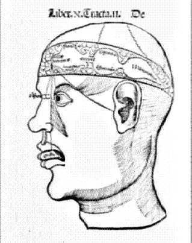</img>

 

இடைக்காலத்தில், மூளை தலைமைசெயலகம் போல மூன்று பகுதிகளாக பிரிக்கப்பட்டு ஓவ்வொரு பகுதியும் அதற்கான பணிகளை ஒருங்கிணைப்பதாக ஆய்வாளர்கள் நம்பினர். 1. முன்புற வென்ட்ரிக்கிள் கற்பனை 2. பின்புற வென்றிக்கிள் நினைவகம் மற்றும் 3. இடைப்பட்ட பகுதி பகுத்தறிதல் ஆகிய பணிகளை செய்கின்றன. எனினும் ஐம்புலங்களிலுருந்து வரும் சமிஞ்ஞைகளை மூளை எந்தப் பகுதி நிர்வகிக்கிறது என்பதில் விஞ்ஞானிகளிடம் ஒருமித்த கருத்து இல்லை. பதினொன்னாம் நூற்றாண்டு விஞ்ஞானிகள் ஐம்புலன்களிலிருந்து பெறப்பட்ட தகவல்களை பொது அறிவு என்று அழைத்தார்கள்.  அவர்கள் பொது அறிவு  "கற்பனைத் திறன்" உடன் தொடர்புடையது. அது ஐம்புலங்களிலிருந்தும் தகவல்களைப்பெற்று அவற்றை நினைவகத்தில் பாதுகாக்கிறது என்றார்கள்.

 

  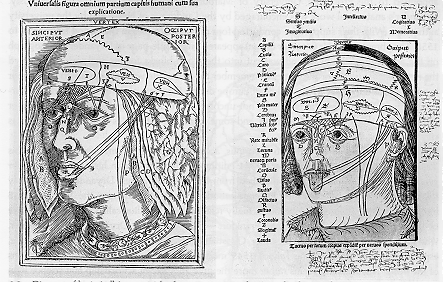</img>

 

ஆனால் 14 ஆம் நூற்றாண்டில் கருத்துக்கள் மாறின. பொது அறிவு மூளையின் நடுவில் இருப்பதாக நம்பப்பட்டது. மூளையின் செயல்பாடுகள் தொடர்பான பல அடிப்படை கேள்விகள் (பொது அறிவு தொடர்பானவை உட்பட) விவாதத்திற்கு உட்படுத்தப்பட்டது. அந்தகாலத்தில் மூளைப்பற்றி மிகக் குறைந்த அறிவே இருந்தது என்பதை தெளிவாக காண முடிகிறது.

மறுமலர்ச்சிக் காலத்தில், மருத்துவர்கள் மூளையை பல சிறிய பிரிவுகளாக பிரித்தார்கள். பதினாறாம் நூற்றாண்டின் நடுப்பகுதியில் பிரசுரிக்கப்பட்ட உடற்கூறியல் விளக்கப் படங்களை அத்தகைய பிரிவுகளை நிரூபிக்கிறது.  புகழ்பெற்ற லியோனார்டோ டா வின்சி மூளையை பிரித்து வரைந்தார். லியோனார்டோவின் படங்கள் அவரது சகாக்களின் படங்களை விட இயற்கையில் மிகவும் உடற்கூறியல் சார்ந்தவை. மூளை, திசு மற்றும் ஆப்டிகல் நரம்புகளுக்கு இடையிலான உறவை அவர் மெழுகு ஊசி மூலம் பரிசோதனைகள் மூலம் முறையாக ஆராய்ந்தார்.வெ ன்ட்ரிக்கிள்ஸ் மற்றும் மெடுல்லாவில் உள்ள நரம்புகளின் தோற்றம் ஆகியவற்றை உற்று நோக்கினார்.  "பொது அறிவு"  மற்றும் ஆன்மாவின் இருப்பிடத்தைக்  கண்டுபிடிப்பதே அவரது அவரது தேடலாக இருந்தது. எனவே அவர் மற்ற பிரிவுகளின் செயல்பாட்டை ஆழ்ந்து நோக்கவில்லை என்கின்றனர் விஞ்ஞானிகள்.

 

  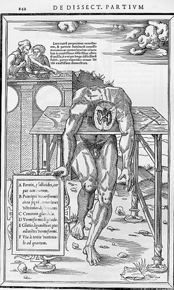</img>

 
 
பதினாறாம் மற்றும் பதினேழாம் நூற்றாண்டின் ஆரம் உடற்கூறியல் வல்லுநர்கள் மூளையின் பகுதிகளை மேலும் விளக்கினர். பெருமூளை(cerebrum), சிறுமூளை(cerebellum) மற்றும் மெடுல்லா போன்ற சொற்கள் பிரபலப்படுத்தப்பட்டன. மூளையில் பல்வேறு பகுதிகளையும் அவை செய்யும் பணிகளையும் புரிந்துகொள்வதில் முன்னேற்றம் ஏற்பட்டது. பதினேழாம் நூற்றாண்டில் விஞ்ஞானிகள் புறணி மற்றும் வென்ட்ரிக்கிள்களைப் பற்றி மிகவும் கவனமாக ஆராயத் தொடங்கினர்.  (மூளையின் இரண்டு படங்கள், பதினாறாம் நூற்றாண்டின் பிற்பகுதியிலும் பதினேழாம் நூற்றாண்டின் நடுப்பகுதியிலிருந்தும்). பின்னர் நிரூபிக்கப்பட்ட சோதனைகள் மூலம் மூளைக்கும் நரம்பியலுக்கும் உள்ள தொடர்பும் அதன் அடிப்படையிலான கொள்கைகளும் நிறுவப்பட்டன.

 

  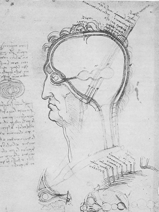</img>

 

பின்னர், 19 ஆம் நூற்றாண்டின் பிற்பகுதியில், ஸ்பானிஷ் மருத்துவர் சாண்டியாகோ காஜல் (குறிப்பு: சாண்டியாகோவின் உருவம்) மூளையின் திசுக்களை கறை படித்து ஆய்வு செய்வதன் மூலம் நியூரான்களை முறையாக அடையாளம் கண்டார். கஜலின் இரண்டு முக்கிய கண்டுபிடுப்புகள் - மூளையில் உள்ள ஒவ்வொரு நியூரானும் தனித்தனியாகவும், நியூரான்கள் ஒத்திசைவுகளில் தொடர்பு கொள்கின்றன - இதை நியூரானின் கோட்பாடு என்றார்  அவர். நியூரான்களுக்கு இடையிலான இடைவெளி ஒரு ஒளி நுண்ணோக்கி மூலம் பார்க்க மிகவும் சிறியதாக இருப்பதால், காமிலோ கோல்கி மற்றும் பிற விஞ்ஞானிகள் நியூரானின் கோட்பாட்டை ஒரு கற்பனை என்று நிராகரித்தனர். கஜல் மனதில் கண்டதை நிஜத்தில் காண தேவையான எலக்ட்ரான் நுண்ணோக்கியை உருவாக்க இன்னும் அரை நூற்றாண்டுகள் ஆகும் என்று எண்ணினார்.  எனவே அவர் 1894 ஆம் ஆண்டில் பேனா மையைப் பயன்படுத்தி தான் மனக்கண்ணில் கண்டதை ஆயிரக்கணக்கான படங்களாக வெளியிட்டார். பின்னர், 20 ஆம் நூற்றாண்டின் முற்பகுதியில், ஆராய்ச்சியாளர்கள் இந்த நரம்பணு செல்கள் எவ்வாறு செயல்படுகின்றன என்பதைப் புரிந்துகொள்ளத் தொடங்கினர்.

 
<table>
  <tr>
    <td align="center16th_and_17th_century_Brain_images_1td>
    <td align="center">16th_and_17th_century_Brain_images_2</td>
  </tr>
  <tr>
    <td valign="center">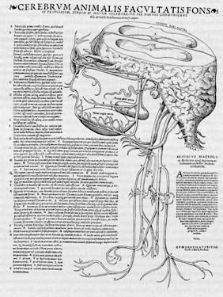</td>
    <td valign="center">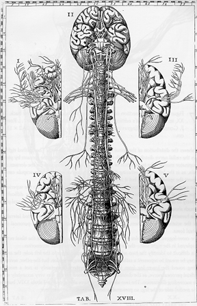</td>
  </tr>
</table>
 

 காஜலின் அழகிய வரைபடங்கள் நியூரான்களைச், தனிப்பட்ட செல்களாக காட்டுகின்றன. அந்த நேரத்தில் பரவலாக நம்பப்பட்டதைப் போல, நரம்பு மண்டலம் தொடர்ச்சியான இழைகளின் நெட்வொர்க் அல்ல என்பதை அவர் முதலில் உணர்ந்தார்.

கணினிகளின் வரவு மூளை ஆராய்சியில் மிகப்பெரிய தாக்கத்தை ஏற்படுத்தியது. ஒவ்வொரு ஆராய்ச்சியும் பரிசோதனைகளையும் அவற்றின் முடிவுகளையும் கணினியில் சேமித்தனர். ஒவ்வொரு முறையும் மூளையை ஆய்வதற்கான மாதிரிகளைப் பெருவது, பரி சோதனைகள் மேற்கொள்வதில் இருந்த சிக்கல்களை கையாளவும் ஏற்கனவே செய்யப்பட்ட சோதனைகளின் முடிவுகளோடு ஒப்பிட்டுப்பார்க்க கணினிகள்  பெருமளவில் உதவின. 

 
<table>
  <tr>
    <td align="center">Santiago Cajal</td>
    <td align="center">Neuron</td>
  </tr>
  <tr>
    <td valign="center">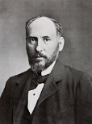</td>
    <td valign="center">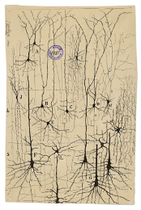</td>
  </tr>
</table>

 

20 ஆம் நூற்றாண்டின் நடுப்பகுதியில், ஆர்வத்தால் தூண்டப்பட்டு, மூளையைப் புரிந்துகொள்வதில் ஏற்பட்ட முன்னேற்றங்களால் ஈர்க்கப்பட்டு, ​​கணினி விஞ்ஞானிகள் மூளையின் அறிவாற்றலை கண்முன் கொண்டுவரும் மாதிரிகளை உருவாக்கினர். அவர்கள் செயற்கை நியூரான்களை செயற்கை நரம்பு அமைப்புகளோடு இணைத்து, நிஜத்தில் மூளை சிறிய பகுதியை மாதிரியாகக் கொண்டு அது செயல்படும் விதத்தை கணினியில் காட்டினர். 

 
<table>
  <tr>
    <td align="center">WalterPitts and WarrenMcCulloch</td>
    <td align="center">FrankRosenblatt</td>
  </tr>
  <tr>
    <td valign="center">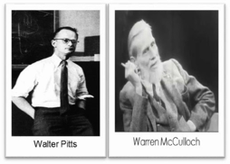</td>
    <td valign="center">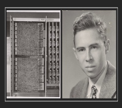</td>
  </tr>
</table>

 

வாரன் மெக்கல்லோக் மற்றும் வால்டர் பிட்ஸ் ஆகியோர் கணிதம் மற்றும் அக்காரிதம்களைப் பயன்படுத்தி மூளை எப்படி சிந்திக்கிறது என்பதற்கான மாதியை உருவாக்கினார்கள். அவர்களின் மாதிரியில் ஒரு சிறிய செயற்கை நியூரான்களின் அடுக்கை உள்ளீடாக பயன்படுத்தி தகவலை அடுத்தடுத்த  நியூரான் அடுக்குகளுக்கு அனுப்பினர். ெக்கல்லோச்-பிட்ஸ்சின் நியூரானின் புதிய அவதாரத்தை **பெர்செப்டிரான்: உணர்தல் மற்றும் அங்கீகரித்தல்** என்ற கட்டூரையை ரோசன்ப்ளாட் வெளியிட்டார்.  இதில் பெர்செப்டிரான்கள் தானாகவே binary classification(இரும வகைப்படுத்தல்) செய்யும் தன்மையை கொண்டவைக உள்ளது என்பதைக் கண்டறிந்தார்.  இது நரம்பியல் வலையமைப்பின் ஆராய்ச்சியில் புரட்சியை ஏற்ப்பட்டது. செயற்கை நுண்ணறிவின் முக்கிய நுட்பமான முன்னோக்கி பரப்புதல்(Forward Propagation) அறிமுகப்படுத்தப்பட்டது.

    

ஃபிராங்க் ரோசன்ப்ளாட்

  
ஹென்றி ஜே கெல்லி

இதைத் தொடர்ந்து, 1960 ஆம் ஆண்டில், ஹென்றி ஜே. கெல்லி தொடர்ச்சியான பின்நோக்கி பரப்புதல்(Back Propagation) மூலம் கணினி மாதிரியை மேம்படுத்தினார். அவரது அணுகுமுறை "கற்றல்" செயல்பாட்டில் பின்னூட்டக் கட்டுப்பாடு (feedback control) என்ற கருத்தை அறிமுகப்படுத்தியது.  பின் பரப்புதலின் இந்த முக்கிய கருத்து 1960 களின் முற்பகுதியில் இருந்தபோதிலும், இது 1985 ஆம் ஆண்டளவில் மட்டுமே பயன்பாட்டிற்கு வந்தது. இந்த  செயற்கை நியூரல் நெட்வொர்க்குகள் உள்ளீடு(input), வெளியீடு(output) மற்றும் இணைக்கப்பட்ட சில அடுக்குகளைக்(layer) கொண்ட ஆழம் குறைந்த, குறைந்த எண்ணிக்கையிலான செயற்கை நியூரான்களைக்கொண்ட வலைப்பின்னல்களாகும்.  ஆனால் ஆழக்கற்றல் என்பது ஆழமான நியூரல் நெட்வொர்க்குகளைக்கொண்ட, ஆழமாக அடுக்கப்பட்ட, பல்லடுக்குகளைக் கொண்ட கோடிக்கணக்கான செயற்கை நியூரான்களைக் கொண்ட வலைப்பின்னலாகும்.

 
<table>
  <tr>
    <td align="center">HenryKelley</td>
    <td align="center">Gradient Theory of Optimal Flight Paths</td>
  </tr>
  <tr>
    <td valign="center"></td>
    <td valign="center">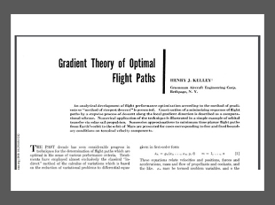</td>
  </tr>
</table>

 

எனவே, எளிய ஆழமற்ற நெட்வொர்க்குகளிலிருந்து சிக்கலான ஆழமான நெட்வொர்க்குகளுக்கு இந்த மாற்றம் எப்போது ஏற்பட்டது? ஆழக் கற்றல் வழிமுறைகளை உருவாக்குவதற்கான ஆரம்பகால முயற்சிகள் உண்மையில் 1965 ஆம் ஆண்டிலிருந்து, அலெக்ஸி கிரிகோரிவிச் இவாக்னென்கோ மற்றும் வாலண்டைன் கிரிகோரெவிச் லாபா ஆகியோர் பல்லுறுப்புறுப்பு(polynomial) செயல்பாட்டுக் கோவை எனப்படும் (activation function) கொண்ட மாதிரிகளைப் பயன்படுத்தினர். பின்னர் அவை புள்ளிவிவர ரீதியாக பகுப்பாய்வு செய்யப்பட்டன. 1970 களில், மார்வின் மின்ஸ்கி மற்றும் சீமோர் பேப்பர்ட் ஆகியோர் “பெர்செப்டிரான்ஸ்” என்ற புத்தகத்தை வெளியிட்டனர். அதில் ரோசன்ப்ளாட்டின் பெர்செப்டிரானால் XOR போன்ற சிக்கலான செயல்பாடுகளை தீர்க்க முடியாது என்பதை விளக்கினர். அத்தகைய செயல்பாட்டிற்கு பெர்செப்டிரான்கள் பல மறைக்கப்பட்ட அடுக்குகளில் வைக்கப்பட வேண்டும், இது பெர்செப்டிரான் கற்றல் முறைகளில் சமரசம் செய்ய வேண்டி இருந்தது. இது “கீழ்நிலை”(bottom up) AI க்கு ஒரு பின்னடைவாக இருந்தது.

பனிப்போர் சமயத்தில் திறம்வாய்ந்த தொழில் நுட்ப நன்மைகளைப் பெறமுடியும் என்ற நம்பிக்கையில் செயற்கை நுண்ணறிவு ஆராய்ச்சிக்காக பல மில்லியன் டாலர்களை அமெரிக்க அரசு செலவு செய்தது. ஆனால் இந்த ஆராய்சியால் பெரிய கிடைத்த பலன்கள் வெகு குறைவே. இதனால் அமெரிக்க காங்கிரஸிலிருந்து கடும் விமர்சனங்கள் எழுந்தன. 1973 ஆம் ஆண்டில், முன்னணி கணிதவியலாளர் பேராசிரியர் சர் ஜேம்ஸ் லைட்ஹில், இங்கிலாந்தில் AI இன் மோசமான நிலை குறித்து ஒரு அறிக்கையை வெளியிட்டார்.

லைட்ஹில்ஸ் என்ற விஞ்ஞானி கணினிகள் ஒரு அனுபவமற்ற சதுரங்க விளையாட்டு விளையாடும் அளவுக்கே திறன் படைத்தவை என்றார். பொது அறிவைக் கொண்டு முகங்களைக் அடையாளம் காணுதல் என்பது கணினியின் திறனுக்கு அப்பாற்பட்டது என்றார் அவர். இதனால் செயற்கை நுண்ணறிவுத்துறைக்கான நிதி குறைக்கப்பட்டது.  இதனால் செயற்கை நுண்ணறிவு மற்றும் ஆழக்கற்றல் துறையின் வளர்சியில் பெரும் பின்னடைவு ஏற்பட்டது. 

இருந்தபோதிலும், ஆர்வமுள்ள ஆராய்ச்சியாளர்கள் நிதியுதவி இல்லாமல் தங்கள் பணியை மேற்கொண்டனர்! குனிஹிகோ புகுஷிமா 1979 ஆம் ஆண்டில் நியோகாக்னிட்ரான் எனப்படும் ஒரு செயற்கை நரம்பியல் வலையமைப்பை உருவாக்கினார். இது பல அடுக்கு மற்றும் படிநிலை வலைப்பின்னல்களைக் கொண்டிருந்தது. இந்த பல அடுக்கு, படிநிலை வடிவமைப்பு கணினிகள் காட்சி வடிவங்களை அங்கீகரிக்க கற்றுக்கொள்ள உதவியது. மாடல்களை உருவாக்கும் போது பின் பரவல் முறை மூலம் மேம்படுத்தப்பட்டு பிழைகள் தனியாக வெளியேற்றப்பட்டதன் மூலம் பற்றுவிக்கும் முறையில் கட்டுப்படுதுவதில் ஆதிக்கம் செலுத்த முடிந்தது. செப்போ லின்னெய்ன்மா தனது மேற்படிப்புக்கான ஆய்வறிக்கையை எழுதியபோது, தனது அறிக்கையில் FORTRAN நிரலியை இணைத்து பின்நோக்கி  பரவல் முறையை விளக்கினார். ஆனால் பின்நோக்கி பரவல் நியூரல் நெட்வொர்க்கில் மிக குறைவாகவே பயன்படுத்தப்பட்டது.  AI work then was primarily focused on top-down, rule based expert systems. Bottom up AI was still languishing. 

The first signs of revival were displayed when in 1985 Hinton and Williams demonstrated back propagation in a neural network which could provide interesting distribution representations. Yann LeCun followed this up by providing the first practical demonstration of backpropagation at Bell Labs in 1989 by combining convolutional neural networks with back propagation to read handwritten digits. The combination of convolutional neural networks with a backpropagation system was then used to read the numbers of handwritten checks spurring business interest. 

Interestingly, though this was a period of renewed interest, the 1985-90s actually are considered by the scientific AI community as the second lull in artificial intelligence. Hardware and software issues plagued the progress of research in neural networks and deep learning. Deep Learning algorithms while producing good results in lab conditions, struggled to scale well to industrial proportions, were quite unstable and seemed unable to generate consistent results. 
Despite these adverse conditions, passionate individuals continued to move the needle. Vladimir Vapnik and Dana Cortes developed the support vector machine which was a data driven system for mapping and recognizing similar data in 1995. Long short-term memory or LSTM was developed in 1997 by Juergen Schmidhuber and Sepp Hochreiter developed Recurrent Neural Networks (RNN).

Then the next significant deep learning advancement happened due to progress help from unexpected quarters! 
Around 1999 computers began to take advantage of GPU processing which were introduced to accelerate the massive amounts of mathematical operations needed for fast image processing and display. Faster processing meant increased computational speeds of 1000 times over a 10-year span. Deep Learning researchers were quick to note that this was exactly what deep neural networks needed and pounced upon GPUs! This quickly led to neural networks competing with support vector machines. Neural networks began to offer better results using the same data, though a tad slower when compared to a support vector machine.

Then in 2001, a research report compiled by the META Group (now called Gartner) was published outlining the challenges and opportunities of massive, three-dimensional, data growth (Volume, Velocity and Variety). This report marked the onslaught of the Big Data and Data Driven Science phenomenon. It described the increasing volume and speed of data as increasing the range of data sources and types. 

Simultaneously, on another front, the cloud phenomenon occurred giving many organizations and individuals democratized access to large compute resource. Deep Learning, which was all data driven and needed massive compute power, suddenly was back in black in a democratized fashion. Fei-Fei Li, an AI professor at Stanford (who launched ImageNet in 2009) began assembling a free, open database of more than 14 million labeled images to the community at large. These images were the inputs needed to train deep neural nets. The speed of GPUs had increased significantly by 2011, making it possible to train deep convolutional neural networks without the need for layer by layer pre-training. Deep learning now held advantages in efficiency, efficacy and speed.

 Then in 2012, Google Brain released the results of an unusual, free-spirited project called the Cat Experiment which explored the difficulties of unsupervised learning. Deep learning deployed supervised learning, which means the convolutional neural net is trained using labeled data like the images from ImageNet. This experiment used a neural net which was spread over 1,000s of computers where ten million unlabeled images were taken randomly from YouTube, as inputs to the training software.  
 
This event is considered the tipping point for Deep Learning. It made students, researchers and corporations around the world sit up, take notice and triggered a wave of scientific efforts and breakthroughs backed by corporate investment in DL. Consequently, today, DL powers several marquee apps like Amazon’s Alexa, Tesla’s Autopilot, Google’s Translation engine and many more. 

The true appeal of Deep Learning is that it has improved the accuracy of a great number of computational tasks from 95 percent to 99 percent or better— that tricky few percent that can make an automated service feel as though it works by magic. Although the concrete, interactive code examples throughout this book will dispel this apparent wizardry, deep learning has indeed imbued machines with superhuman capability on complex tasks as diverse as face recognition, text summarization, and elaborate board games. Given all these prominent advances, it is unsurprising that “deep learning” has become synonymous with “artificial intelligence” in the popular press, the workplace, and the home.

2. See bit.ly/ aiindex18 for a review of machine performance relative to humans.

In summary, these are exciting times, because, as you’ll discover over the course of this book, perhaps only once in a lifetime has a single concept has cause disruption so widely in such a short period of time. We are delighted that you too have developed an interest in deep learning and we can’t wait to share our enthusiasm for this unprecedented, transformative technique with you.

A Summary Deep Learning Timeline

1943
1943
McCulloch Pitts Neuron – Beginning
 
Walter Pitts and Warren McCulloch in their paper, “A Logical Calculus of the Ideas Immanent in Nervous Activity” shows the mathematical model of biological neuron. This McCulloch Pitts Neuron has very limited capability and has no learning mechanism. Yet it will lay the foundation for artificial neural network & deep learning.
1957
1957
Frank Rosenblatt Creates Perceptron
 
In his paper “The Perceptron: A Perceiving and Recognizing Automaton”, Rosenblatt shows the new avatar of McCulloch-Pitts neuron – ‘Perceptron’ that had true learning capabilities to do binary classification on it’s own. This inspires the revolution in research of shallow neural network for years to come, till first AI winter.
1960
1960
The First Backpropagation Model
 
Henry J. Kelley in his paper, “Gradient Theory of Optimal Flight Paths” shows the first ever version of continuous backpropagation model. His model is in context to Control Theory, yet it lays the foundation for further refinement in the model and would be used in ANN in future years.
1962
1962
Backpropagation With Chain Rule
 
Stuart Dreyfus in his paper, “The numerical solution of variational problems” shows a backpropagation model that uses simple derivative chain rule, instead of dynamic programming which earlier backpropagation models were using. This is yet another small step that strengthens the future of deep learning.
1965
1965
Birth Of Multilayer Neural Network
 
Alexey Grigoryevich Ivakhnenko along with Valentin Grigorʹevich Lapa, creates hierarchical representation of neural network that uses polynomial activation function and are trained using Group Method of Data Handling (GMDH). It is now considered as the first ever multi-layer perceptron and Ivakhnenko is often considered as father of deep learning.
1969
1969
The Fall Of Perceptron
 
Marvin Minsky and Seymour Papert publishes the book “Perceptrons” in which they show that Rosenblatt’s perceptron cannot solve complicated functions like XOR. For such function perceptrons should be placed in multiple hidden layers which compromises perceptron learning algorithm. This setback triggers the winter of neural network research.
1970
1970
Backpropagation Is Computer Coded
 
Seppo Linnainmaa publishes general method for automatic differentiation for backpropagation and also implements backpropagation in computer code. The research in backpropagation has now come very far, yet it would not be implemented in neural network till next decade.
1971
1971
Neural Network Goes Deep
 
Alexey Grigoryevich Ivakhnenko continues his research in Neural Network. He creates 8-layer Deep neural network using Group Method of Data Handling (GMDH).
1980
1980
Neocognitron – First CNN Architecture
Kunihiko Fukushima comes up with Neocognitron, the first convolutional neural network architecture which could recognize visual patterns such as handwritten characters.
1982
1982
Hopfield Network – Early RNN
 
John Hopfield creates Hopfield Network, which is nothing but a recurrent neural network. It serves as a content-addressable memory system, and would be instrumental for further RNN models of modern deep learning era.
1985
1985
Boltzmann Machine
 
Geoffrey Hinton and Terrence Sejnowski create Boltzmann Machine that is a stochastic recurrent neural network. This neural network has only input layer and hidden layer but no output layer.
1986
1986
NetTalk – ANN Learns Speech
Terry Sejnowski creates NeTalk, a neural network which learns to pronounce written English text by being shown text as input and matching phonetic transcriptions for comparison.
1986
Backpropagation In Neural Network
 
Geoffrey Hinton, Rumelhart and Williams in their paper “Learning Representations by back-propagating errors” show a new and better learning procedure for neural network by using backpropagation. It opened gates for training complex deep neural network easily which was the main obstruction in earlier days of research in this area.
1986
Restricted Boltzmann Machine
 
Paul Smolensky comes up with a variation of Boltzmann Machine where there is not intra layer connection in input and hidden layer. It is known as Restricted Boltzmann Machine (RBM). It would become popular in years to come especially for building recommender systems.
1989
1989
CNN Using Backpropagation
Yann LeCun uses backpropagation to train convolutional neural network to recognize handwritten digits. This is a breakthrough moment as it lays the foundation of modern computer vision using deep learning.
1989
Universal Approximators Theorem
 
George Cybenko publishes earliest version of the Universal Approximation Theorem in his paper “Approximation by superpositions of a sigmoidal function“. He proves that feed forward neural network with single hidden layer containing finite number of neurons can approximate any continuous function. It further adds credibility to Deep Learning.
1991
1991
Vanishing Gradient Problem Appears
 
Sepp Hochreiter identifies the problem of vanishing gradient which can make the learning of deep neural network extremely slow and almost impractical. This problem will continue to annoy deep learning community for many more years to come.
1997
1997
The Milestone Of LSTM
 
Sepp Hochreiter and Jürgen Schmidhuber publishes a milestone paper on “Long Short-Term Memory” (LSTM). It is a type of recurrent neural network architecture which will go on to revolutionize deep learning in decades to come.
2006
2006
Deep Belief Network
 
Geoffrey Hinton, Ruslan Salakhutdinov, Osindero and Teh publishes the paper “A fast learning algorithm for deep belief nets” in which they stacked multiple RBMs together in layers and called them Deep Belief Networks. The training process is much more efficient for large amount of data.
2008
2008
GPU Revolution Begins
 
Andrew NG’s group in Stanford starts advocating for the use of GPUs for training Deep Neural Networks to speed up the training time by many folds. This could bring practicality in the field of Deep Learning for training on huge volume of data efficiently.
2011
2011
Combat For Vanishing Gradient
 
Yoshua Bengio, Antoine Bordes, Xavier Glorot in their paper “Deep Sparse Rectifier Neural Networks” shows that ReLU activation function can avoid vanishing gradient problem. This means that now, apart from GPU, deep learning community has another tool to avoid issues of longer and impractical training times of deep neural network.
2012
2012
AlexNet Starts Deep Learning Boom
 
AlexNet, a GPU implemented CNN model designed by Alex Krizhevsky, wins Imagenet’s image classification contest with accuracy of 84%.  It is a huge jump over 75% accuracy that earlier models had achieved. This win triggers a new deep learning boom globally.
2014
2014
The Birth Of GANs
 
Generative Adversarial Neural Network also known as GAN is created by Ian Goodfellow. GANs open a whole new doors of application of deep learning in fashion, art, science due it’s ability to synthesize real like data.
2016
2016
AlphaGo Beats Human
 
Deepmind’s deep reinforcement learning model beats human champion in the complex game of Go. The game is much more complex than chess, so this feat captures the imagination of everyone and takes the promise of deep learning to whole new level.
2019
2019
Godfathers Win Turing Award
 
Yoshua Bengio, Geoffrey Hinton, and Yann LeCun wins Turing Award 2018 for their immense contribution in advancements in area of deep learning and artificial intelligence. This is a defining moment for those who had worked relentlessly on neural networks when entire machine learning community had moved away from it in 1970s.
 

