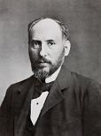
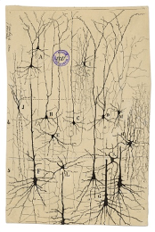
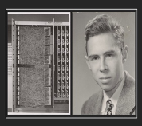

# எளிய முறையில் ஆழக்கற்றல்

**ஆழக்கற்றல் தோற்றம்**

ஆழக்கற்றல் தற்போது புதிய துறை போல எல்லாருக்கும் தோன்றுகிறது. ஆனால் உண்மையில் இது ஒரு பழங்கதை. மனித குலம் தோன்றியது போதே, மனிதன் பகுத்தறிய ஆரம்பித்தபோதே இந்த துறை தோன்றிவிட்டது எனலாம். 

ஆழக்கற்றலை புரிந்துகொள்ள  மூளை எப்படி சிந்திக்கிறது என்பதைப் புரிந்துகொள்வது அவசியம்:

1. சிந்தனை மூளையில் உதயமாகிறது
2. மூளையில் கோடிக்கணக்கான நீயூரான்கள் எனப்படும் செல்கள் உள்ளன.
3. இது நியூரான்கள் ஒரு ஒருங்கிணைந்த “நுண்ணறிவு” வலையமைப்பாக இணைந்து செயல்படுகின்றன, இது சிந்திக்கவும், உணரவும், செயல்படவும் உதவுகிறது

பல ஆண்டுகாளாக பல விஞ்ஞானிகள் அல்லும் பகலும் ஆராச்சிகள் செய்து மூளை எவ்வாறு செயல்படுகிறது என்பதைக் கண்டறிந்தனர்.

மூளை பழங்காலத்தில் (பி.சி.இ) இருந்து தொடர்ந்து ஆய்வு செய்யப்படுவதாக வரலாற்று சான்றுகள் பல உள்ளன. பண்டைய காலத்தைச் சேர்ந்த விஞ்ஞானிகள், பல நாகரிகங்களில், மூளையை அதன் செயல்பாடுகளைப் புரிந்துகொள்ள ஆய்வு செய்து, அந்த அறிவை மருத்துவ நோக்கங்களுக்காகப் பயன்படுத்தினர்.
*(குறிப்பு: சரகர், சுஷ்ருர், ஹரப்பாவில் ட்ரெபனேஷன் உள்ளிட்ட மூளையைப் படித்த இந்திய வரலாற்று அறிஞ்ஞர்களின் படங்கள் https: // bit. ly / 38tt9L5; பாபிலோனிய, எகிப்திய முயற்சிகள்).*

முதலாம் நூற்றாண்டின் தொடக்கத்திலிருந்து பொது சகாப்பதம்(early common era) 1700 இன் முற்பகுதி வரையிலான காலகட்டத்தில் மூளை பற்றிய பொதுவான விளக்கத்தை மக்கள் அறிந்திருந்தனர். மூளையில் உள்ள மென் மற்றும் கடினமான அடுக்குகள் மற்றும் மூளையின் சில பகுதிகள் ஆற்றும் பணிகளையும் விஞ்ஞானிகள் அறிந்திருந்தனர்.

முற்காலத்தில் மூளை விந்தணுக்களால் உருவான குளிர்ச்சியான, ஈரமான உறுப்பு என்று மக்கள் கருதினார்கள். சில நூற்றாண்டுகள் ஆய்வுக்குப் பிறகு, மனது என்பது இதயம் சம்மந்தப்பட்டது இல்லை அது மூளை சம்மந்தப்பட்டது என்ற முடிவுக்கு வந்தனர் மேலும் அவர்கள் மூளை ஆன்மாவின் இருக்கை என்றும் உடலில் காணப்படும் மூன்று ஆன்மாக்களில் ஒன்று என்றும், அது மற்ற ஒரு முக்கிய உறுப்புகளுட தொடர்புடையது என்றும் விஞ்ஞானிகள் முடிவு செய்தனர் . இது இப்போது படிப்பதற்கு சாதாரணமாக தோன்றினாலும், அந்த காலத்தில் மூளை பற்றிய ஆராய்சியில் இது முக்கிய படிக்கல்லாக இருந்தது.

 

  </img>

 

இடைக்காலத்தில், மூளை தலைமைசெயலகம் போல மூன்று பகுதிகளாக பிரிக்கப்பட்டு ஓவ்வொரு பகுதியும் அதற்கான பணிகளை ஒருங்கிணைப்பதாக ஆய்வாளர்கள் நம்பினர். 1. முன்புற வென்ட்ரிக்கிள் கற்பனை 2. பின்புற வென்றிக்கிள் நினைவகம் மற்றும் 3. இடைப்பட்ட பகுதி பகுத்தறிதல் ஆகிய பணிகளை செய்கின்றன. எனினும் ஐம்புலங்களிலுருந்து வரும் சமிஞ்ஞைகளை மூளை எந்தப் பகுதி நிர்வகிக்கிறது என்பதில் விஞ்ஞானிகளிடம் ஒருமித்த கருத்து இல்லை. பதினொன்னாம் நூற்றாண்டு விஞ்ஞானிகள் ஐம்புலன்களிலிருந்து பெறப்பட்ட தகவல்களை பொது அறிவு என்று அழைத்தார்கள்.  அவர்கள் பொது அறிவு  "கற்பனைத் திறன்" உடன் தொடர்புடையது. அது ஐம்புலங்களிலிருந்தும் தகவல்களைப்பெற்று அவற்றை நினைவகத்தில் பாதுகாக்கிறது என்றார்கள்.

 

  </img>

 

ஆனால் 14 ஆம் நூற்றாண்டில் கருத்துக்கள் மாறின. பொது அறிவு மூளையின் நடுவில் இருப்பதாக நம்பப்பட்டது. மூளையின் செயல்பாடுகள் தொடர்பான பல அடிப்படை கேள்விகள் (பொது அறிவு தொடர்பானவை உட்பட) விவாதத்திற்கு உட்படுத்தப்பட்டது. அந்தகாலத்தில் மூளைப்பற்றி மிகக் குறைந்த அறிவே இருந்தது என்பதை தெளிவாக காண முடிகிறது.

மறுமலர்ச்சிக் காலத்தில், மருத்துவர்கள் மூளையை பல சிறிய பிரிவுகளாக பிரித்தார்கள். பதினாறாம் நூற்றாண்டின் நடுப்பகுதியில் பிரசுரிக்கப்பட்ட உடற்கூறியல் விளக்கப் படங்களை அத்தகைய பிரிவுகளை நிரூபிக்கிறது.  புகழ்பெற்ற லியோனார்டோ டா வின்சி மூளையை பிரித்து வரைந்தார். லியோனார்டோவின் படங்கள் அவரது சகாக்களின் படங்களை விட இயற்கையில் மிகவும் உடற்கூறியல் சார்ந்தவை. மூளை, திசு மற்றும் ஆப்டிகல் நரம்புகளுக்கு இடையிலான உறவை அவர் மெழுகு ஊசி மூலம் பரிசோதனைகள் மூலம் முறையாக ஆராய்ந்தார்.வெ ன்ட்ரிக்கிள்ஸ் மற்றும் மெடுல்லாவில் உள்ள நரம்புகளின் தோற்றம் ஆகியவற்றை உற்று நோக்கினார்.  "பொது அறிவு"  மற்றும் ஆன்மாவின் இருப்பிடத்தைக்  கண்டுபிடிப்பதே அவரது அவரது தேடலாக இருந்தது. எனவே அவர் மற்ற பிரிவுகளின் செயல்பாட்டை ஆழ்ந்து நோக்கவில்லை என்கின்றனர் விஞ்ஞானிகள்.

 

  </img>

 
 
பதினாறாம் மற்றும் பதினேழாம் நூற்றாண்டின் ஆரம் உடற்கூறியல் வல்லுநர்கள் மூளையின் பகுதிகளை மேலும் விளக்கினர். பெருமூளை (cerebrum), சிறுமூளை (cerebellum) மற்றும் மெடுல்லா போன்ற சொற்கள் பிரபலப்படுத்தப்பட்டன. மூளையில் பல்வேறு பகுதிகளையும் அவை செய்யும் பணிகளையும் புரிந்துகொள்வதில் முன்னேற்றம் ஏற்பட்டது. பதினேழாம் நூற்றாண்டில் விஞ்ஞானிகள் புறணி மற்றும் வென்ட்ரிக்கிள்களைப் பற்றி மிகவும் கவனமாக ஆராயத் தொடங்கினர்.  (மூளையின் இரண்டு படங்கள், பதினாறாம் நூற்றாண்டின் பிற்பகுதியிலும் பதினேழாம் நூற்றாண்டின் நடுப்பகுதியிலிருந்தும்).  பின்னர் நிரூபிக்கப்பட்ட சோதனைகள் மூலம் மூளைக்கும் நரம்பியலுக்கும் உள்ள தொடர்பும் அதன் அடிப்படையிலான கொள்கைகளும் நிறுவப்பட்டன.

 

  </img>

 

பின்னர், 19 ஆம் நூற்றாண்டின் பிற்பகுதியில், ஸ்பானிஷ் மருத்துவர் சாண்டியாகோ காஜல் (குறிப்பு: சாண்டியாகோவின் உருவம்) மூளையின் திசுக்களை கறை படித்து ஆய்வு செய்வதன் மூலம் நியூரான்களை முறையாக அடையாளம் கண்டார். கஜலின் இரண்டு முக்கிய கண்டுபிடுப்புகள் - மூளையில் உள்ள ஒவ்வொரு நியூரானும் தனித்தனியாகவும், நியூரான்கள் ஒத்திசைவுகளில் தொடர்பு கொள்கின்றன - இதை நியூரானின் கோட்பாடு என்றார்  அவர். நியூரான்களுக்கு இடையிலான இடைவெளி ஒரு ஒளி நுண்ணோக்கி மூலம் பார்க்க மிகவும் சிறியதாக இருப்பதால், காமிலோ கோல்கி மற்றும் பிற விஞ்ஞானிகள் நியூரானின் கோட்பாட்டை ஒரு கற்பனை என்று நிராகரித்தனர். கஜல் மனதில் கண்டதை நிஜத்தில் காண தேவையான எலக்ட்ரான் நுண்ணோக்கியை உருவாக்க இன்னும் அரை நூற்றாண்டுகள் ஆகும் என்று எண்ணினார்.  எனவே அவர் 1894 ஆம் ஆண்டில் பேனா மையைப் பயன்படுத்தி தான் மனக்கண்ணில் கண்டதை ஆயிரக்கணக்கான படங்களாக வெளியிட்டார். பின்னர், 20 ஆம் நூற்றாண்டின் முற்பகுதியில், ஆராய்ச்சியாளர்கள் இந்த நரம்பணு செல்கள் எவ்வாறு செயல்படுகின்றன என்பதைப் புரிந்துகொள்ளத் தொடங்கினர்.

 
<table>
  <tr>
    <td align="center16th_and_17th_century_Brain_images_1td>
    <td align="center">16th_and_17th_century_Brain_images_2</td>
  </tr>
  <tr>
    <td valign="center"></td>
    <td valign="center"></td>
  </tr>
</table>
 

 காஜலின் அழகிய வரைபடங்கள் நியூரான்களைச், தனிப்பட்ட செல்களாக காட்டுகின்றன. அந்த நேரத்தில் பரவலாக நம்பப்பட்டதைப் போல, நரம்பு மண்டலம் தொடர்ச்சியான இழைகளின் நெட்வொர்க் அல்ல என்பதை அவர் முதலில் உணர்ந்தார்.

கணினிகளின் வரவு மூளை ஆராய்சியில் மிகப்பெரிய தாக்கத்தை ஏற்படுத்தியது. ஒவ்வொரு ஆராய்ச்சியும் பரிசோதனைகளையும் அவற்றின் முடிவுகளையும் கணினியில் சேமித்தனர். ஒவ்வொரு முறையும் மூளையை ஆய்வதற்கான மாதிரிகளைப் பெருவது, பரி சோதனைகள் மேற்கொள்வதில் இருந்த சிக்கல்களை கையாளவும் ஏற்கனவே செய்யப்பட்ட சோதனைகளின் முடிவுகளோடு ஒப்பிட்டுப்பார்க்க கணினிகள்  பெருமளவில் உதவின. 

 
<table>
  <tr>
    <td align="center">Santiago Cajal</td>
    <td align="center">Neuron</td>
  </tr>
  <tr>
    <td valign="center"></td>
    <td valign="center"></td>
  </tr>
</table>

 

20 ஆம் நூற்றாண்டின் நடுப்பகுதியில், ஆர்வத்தால் தூண்டப்பட்டு, மூளையைப் புரிந்துகொள்வதில் ஏற்பட்ட முன்னேற்றங்களால் ஈர்க்கப்பட்டு, ​​கணினி விஞ்ஞானிகள் மூளையின் அறிவாற்றலை கண்முன் கொண்டுவரும் மாதிரிகளை உருவாக்கினர். அவர்கள் செயற்கை நியூரான்களை செயற்கை நரம்பு அமைப்புகளோடு இணைத்து, நிஜத்தில் மூளை சிறிய பகுதியை மாதிரியாகக் கொண்டு அது செயல்படும் விதத்தை கணினியில் காட்டினர். 

 
<table>
  <tr>
    <td align="center">WalterPitts and WarrenMcCulloch</td>
    <td align="center">FrankRosenblatt</td>
  </tr>
  <tr>
    <td valign="center"></td>
    <td valign="center"></td>
  </tr>
</table>

 

**வாரன் மெக்கல்லோக்** மற்றும் **வால்டர் பிட்ஸ்** ஆகியோர் கணிதம் மற்றும் அல்காரிதம்களைப் பயன்படுத்தி மூளை எப்படி சிந்திக்கிறது என்பதற்கான மாதியை உருவாக்கினார்கள். அவர்களின் மாதிரியில் ஒரு சிறிய செயற்கை நியூரான்களின் அடுக்கை உள்ளீடாக பயன்படுத்தி தகவலை அடுத்தடுத்த  நியூரான் அடுக்குகளுக்கு அனுப்பினர். ெக்கல்லோச்-பிட்ஸ்சின் நியூரானின் புதிய அவதாரத்தை **பெர்செப்டிரான்: உணர்தல் மற்றும் அங்கீகரித்தல்** என்ற கட்டூரையை ரோசன்ப்ளாட் வெளியிட்டார்.  இதில் பெர்செப்டிரான்கள் தானாகவே **binary classification** (**இரும வகைப்படுத்தல்**) செய்யும் தன்மையை கொண்டவைக உள்ளது என்பதைக் கண்டறிந்தார்.  இது நரம்பியல் வலையமைப்பின் ஆராய்ச்சியில் புரட்சியை ஏற்ப்பட்டது. செயற்கை நுண்ணறிவின் முக்கிய நுட்பமான **முன்னோக்கி பரப்புதல்** (**Forward Propagation**) அறிமுகப்படுத்தப்பட்டது.

    

ஃபிராங்க் ரோசன்ப்ளாட்

  
ஹென்றி ஜே கெல்லி

இதைத் தொடர்ந்து, 1960 ஆம் ஆண்டில், ஹென்றி ஜே. கெல்லி தொடர்ச்சியான பின்நோக்கி பரப்புதல்(Back Propagation) மூலம் கணினி மாதிரியை மேம்படுத்தினார். அவரது அணுகுமுறை "கற்றல்" செயல்பாட்டில் பின்னூட்டக் கட்டுப்பாடு (feedback control) என்ற கருத்தை அறிமுகப்படுத்தியது.  பின் பரப்புதலின் இந்த முக்கிய கருத்து 1960 களின் முற்பகுதியில் இருந்தபோதிலும், இது 1985 ஆம் ஆண்டளவில் மட்டுமே பயன்பாட்டிற்கு வந்தது. இந்த  செயற்கை நியூரல் நெட்வொர்க்குகள் உள்ளீடு (input), வெளியீடு (output) மற்றும் இணைக்கப்பட்ட சில அடுக்குகளைக் (layer) கொண்ட ஆழம் குறைந்த, குறைந்த எண்ணிக்கையிலான செயற்கை நியூரான்களைக்கொண்ட வலைப்பின்னல்களாகும்.  ஆனால் ஆழக்கற்றல் என்பது ஆழமான நியூரல் நெட்வொர்க்குகளைக்கொண்ட, ஆழமாக அடுக்கப்பட்ட, பல்லடுக்குகளைக் கொண்ட கோடிக்கணக்கான செயற்கை நியூரான்களைக் கொண்ட வலைப்பின்னலாகும்.

 
<table>
  <tr>
    <td align="center">HenryKelley</td>
    <td align="center">Gradient Theory of Optimal Flight Paths</td>
  </tr>
  <tr>
    <td valign="center"></td>
    <td valign="center"></td>
  </tr>
</table>

 

எனவே, எளிய ஆழமற்ற நெட்வொர்க்குகளிலிருந்து சிக்கலான ஆழமான நெட்வொர்க்குகளுக்கு இந்த மாற்றம் எப்போது ஏற்பட்டது? ஆழக் கற்றல் வழிமுறைகளை உருவாக்குவதற்கான ஆரம்பகால முயற்சிகள் உண்மையில் 1965 ஆம் ஆண்டிலிருந்து, அலெக்ஸி கிரிகோரிவிச் இவாக்னென்கோ மற்றும் வாலண்டைன் கிரிகோரெவிச் லாபா ஆகியோர் பல்லுறுப்புறுப்பு (polynomial) செயல்பாட்டுக் கோவை எனப்படும் (activation function) கொண்ட மாதிரிகளைப் பயன்படுத்தினர். பின்னர் அவை புள்ளிவிவர ரீதியாக பகுப்பாய்வு செய்யப்பட்டன. 1970 களில், மார்வின் மின்ஸ்கி மற்றும் சீமோர் பேப்பர்ட் ஆகியோர் “பெர்செப்டிரான்ஸ்” என்ற புத்தகத்தை வெளியிட்டனர். அதில் ரோசன்ப்ளாட்டின் பெர்செப்டிரானால் XOR போன்ற சிக்கலான செயல்பாடுகளை தீர்க்க முடியாது என்பதை விளக்கினர். அத்தகைய செயல்பாட்டிற்கு பெர்செப்டிரான்கள் பல மறைக்கப்பட்ட அடுக்குகளில் வைக்கப்பட வேண்டும், இது பெர்செப்டிரான் கற்றல் முறைகளில் சமரசம் செய்ய வேண்டி இருந்தது. இது **கீழ்நிலை** (bottom up) AI க்கு ஒரு பின்னடைவாக இருந்தது.

பனிப்போர் சமயத்தில் திறம்வாய்ந்த தொழில் நுட்ப நன்மைகளைப் பெறமுடியும் என்ற நம்பிக்கையில் செயற்கை நுண்ணறிவு ஆராய்ச்சிக்காக பல மில்லியன் டாலர்களை அமெரிக்க அரசு செலவு செய்தது. ஆனால் இந்த ஆராய்சியால் பெரிய கிடைத்த பலன்கள் வெகு குறைவே. இதனால் அமெரிக்க காங்கிரஸிலிருந்து கடும் விமர்சனங்கள் எழுந்தன. 1973 ஆம் ஆண்டில், முன்னணி கணிதவியலாளர் பேராசிரியர் சர் ஜேம்ஸ் லைட்ஹில், இங்கிலாந்தில் AI இன் மோசமான நிலை குறித்து ஒரு அறிக்கையை வெளியிட்டார்.

லைட்ஹில்ஸ் என்ற விஞ்ஞானி கணினிகள் ஒரு அனுபவமற்ற சதுரங்க விளையாட்டு விளையாடும் அளவுக்கே திறன் படைத்தவை என்றார். பொது அறிவைக் கொண்டு முகங்களைக் அடையாளம் காணுதல் என்பது கணினியின் திறனுக்கு அப்பாற்பட்டது என்றார் அவர். இதனால் செயற்கை நுண்ணறிவுத்துறைக்கான நிதி குறைக்கப்பட்டது.  இதனால் செயற்கை நுண்ணறிவு மற்றும் ஆழக்கற்றல் துறையின் வளர்சியில் பெரும் பின்னடைவு ஏற்பட்டது. 

இருந்தபோதிலும், ஆர்வமுள்ள ஆராய்ச்சியாளர்கள் நிதியுதவி இல்லாமல் தங்கள் பணியை மேற்கொண்டனர்! குனிஹிகோ புகுஷிமா 1979 ஆம் ஆண்டில் நியோகாக்னிட்ரான் எனப்படும் ஒரு செயற்கை நரம்பியல் வலையமைப்பை உருவாக்கினார். இது பல அடுக்கு மற்றும் படிநிலை வலைப்பின்னல்களைக் கொண்டிருந்தது. இந்த பல அடுக்கு, படிநிலை வடிவமைப்பு கணினிகள் காட்சி வடிவங்களை அங்கீகரிக்க கற்றுக்கொள்ள உதவியது. மாடல்களை உருவாக்கும் போது பின் பரவல் முறை மூலம் மேம்படுத்தப்பட்டு பிழைகள் தனியாக வெளியேற்றப்பட்டதன் மூலம் பற்றுவிக்கும் முறையில் கட்டுப்படுதுவதில் ஆதிக்கம் செலுத்த முடிந்தது. செப்போ லின்னெய்ன்மா தனது மேற்படிப்புக்கான ஆய்வறிக்கையை எழுதியபோது, தனது அறிக்கையில் FORTRAN நிரலியை இணைத்து பின்நோக்கி  பரவல் முறையை விளக்கினார். ஆனால் பின்நோக்கி பரவல் நியூரல் நெட்வொர்க்கில் மிக குறைவாகவே பயன்படுத்தப்பட்டது.  AI work then was primarily focused on top-down, rule based expert systems. Bottom up AI was still languishing. 

1985 ஆம் ஆண்டில் ஹிண்டன் மற்றும் வில்லியம்ஸ் நியூரல் நெட்வொர்க்கின் back propagation எனப்படும் பின் பவரலை செயல் விளக்கம்(demonstrated) மூலம் காட்டினர். 1989 ஆம் ஆண்டு  பெல் ஆராச்சிமையத்தில் யான் லீகூன் எண்களை கையால் எழுதி மாற்றத்தக்க நரம்பியல் வலைப்பின்னல்(convolutional neural network) முறைமூலம் எப்படி எண்களைக் கண்டறிவது என்று விளக்கினார். அன்றிலிருந்து  காசோலையில் உள்ள கையெழுத்துக்களை கண்டறிய மாற்றத்தக்க நரம்பியல் வலைப்பின்னல் முறை பயன்படுத்தப்படுகிறது.  

1985-90களில் நிரூபிக்க முடிந்த சில ஆய்வுகள் இருந்த போதிலும் ஆர்சிஃபிஷியல் இண்டலிஜெண்ட் என்று அழைக்கப்படும் செயற்கை நுண்ணறிவுத்துறையின் வளர்சி மந்தமாகவே இருந்தது.  வன்பொருள் மற்றும் மென்பொருள் துறையில் ஏற்பட்ட வளர்சி செயற்கை நுண்ணறிவுத்துறையை சற்று பின்னுக்குத் தள்ளியது.  ஆழக்கற்றல் அல்காரிதம்களின் முடிவுகள் ஆய்வகத்தில் துள்ளியமாக வேலை செய்தாலும், தொழிற்சாலைகளில் பெரிய அளவில் பயன்படுத்தும் போது முடிகள் வேறுபட்டும், நிலையற்றும், சீரற்றும் இருந்தது. இப்படிப்பட்ட மோசமான சூழலிலும், தன்னார்வலர்கள் சிலர் தொடர்சியாக முயன்றார்கள். 1995 ஆம் ஆண்டு 
விளாடிமிர் வாப்னிக் மற்றும் டானா கோர்டெஸ் ஒத்த தரவுகளை வகைப்படுத்த வெட்டர் இயந்திரம் ஒன்றை உருவாக்கினார்கள். நீண்ட குறுகிய கால நினைவகம்(Long short-term memory) அல்லது LSTM 1997 இல் ஜூர்கன் ஷ்மிதூபரால் உருவாக்கப்பட்டது. அதைத் தொடர்ந்து செப் ஹோக்ரைட்டர் தொடர்ச்சியான நரம்பியல் வலையமைப்ப்ய்(ecurrent Neural Networks) எனப்படும் RNN ஐ உருவாக்கினார்.

ஆழக்கற்றல் துறையின் அடுத்த மிக முக்கியமான முன்னேற்றம் 1999 இல் நிகழ்ந்தது. அந்த சமயத்தில் GPU எனப்படும் அதிக செயல் திறந் கொண்ட நினைவகங்கள் கொண்ட கணிகள் செயல்பாட்டுக்கு வந்தன. 10 ஆண்டுகால இடைவெளியில் 1000 மடங்கு அதிவேக செயலாக்கத் திறனுடன் கணினிகள் இயங்கின. இதன் விளைவாக நியூரல் நெட்வொர்க்குகள் வெக்டார் இயந்திரங்களை பயன்படுத்தி ஒரு சீரான, நிலையான முடிவுகளை வெளியிட்டன.

பின்னர் 2001 ஆம் ஆண்டில், மெட்டா குழுமத்தால் (இப்போது கார்ட்னர் என்று அழைக்கப்படுகிறது) தொகுக்கப்பட்ட ஒரு ஆய்வு அறிக்கை பிரமாண்டமான, முப்பரிமாண, தரவு வளர்ச்சியின் (Volume, Velocity and Variety) சவால்கள் மற்றும் வாய்ப்புகளை கோடிட்டுக் காட்டியது. இந்த அறிக்கை பிக் டேட்டா மற்றும் டேட்டா டிரைவன் சயின்ஸ் நிகழ்வின் வளர்சியை விளக்கியது. தரவுகளின் அளவு மற்றும் வேகத்தை தரவு மூலங்கள் மற்றும் வகைகளின் வரம்பை அதிகரிப்பதாக இது விவரித்தது.

அதே சமயம் கிளவுட் கம்ப்யூட்டிங் துறையில் வளர்சியால் தேவைக்கேற்ற அளவு கணினி திறன்களை இணையம் மூலம் பெற முடிந்தது.  அதிக அளவிலான தரவுகளை கையாளும் முறை எளிமையானது.  ஸ்டான் ஃபர்ட் பல்கலைக்கழக பேராசியர் ஃபீ-ஃபை லி, 14 மில்லியனுக்கும் அதிகமான பெயரிடப்பட்ட படங்களின் இலவச, திறந்த தரவுத்தளத்தை சமூகத்திற்கு அற்பனித்தார். இந்த படங்கள் ஆழமான நரம்பியல் வலைகளைப் பயிற்றுவிக்க உதவின. 2011 ஆம் ஆண்டளவில் ஜி.பீ.யுகளின் வேகம் கணிசமாக அதிகரித்துள்ளது. இதனால்  ஆழமான மாற்றதகு நரம்பியல் வலைப்பின்னல்(convolutional neural net) மூலம் அடுக்கடுக்காக பயிற்றுவிப்பதில்,  நேரடியான பயிற்சி அளிக்க முடிந்தது. 

2012 இல் கூகிள் பூனை பரிசோதனை என்ற பெயரில் மேற்பார்வை செய்யப்படாத தரவுகளை கையாள்வதில் உள்ள சிக்கல்களை பற்றிய ஆய்வை வெளியிட்டது.  இதற்கு முன் இமேஜ் நெடட்டில் கிடைத்த தரவுகளைக்கொண்டு மேற்பார்வை செய்யப்பட்டு, லேபில் செய்யப்பட்ட தரவுகளைக் கொண்டு மாற்றதகு நரம்பியல் வலைப்பின்னல்(convolutional neural net) மூலம் பயிற்றுவிக்கப்பட்டது. ஆனால் இந்த சோதனை யூ-ட்யூப் காணொலியில் இருந்து ஆயிரக்கணக்கான கணினிகளைப் பயன்படுத்தில் பல மில்லியன் படங்களை தோராயமாக பிரித்தெடுத்து பயிற்றுவிக்க தேவையான தரவுகள் உருவாக்கப்பட்டது. 

இந்த நிகழ்வு ஆழக்கற்றல் துறையில் ஒரு முக்கிய மைல் கல்லாக பார்க்கப்பட்டது. இது உலகெங்கிலும் உள்ள மாணவர்கள், ஆராய்ச்சியாளர்கள் மற்றும் பெரு நிறுவனங்களை ஆழக்கற்றல் துறைக்குள் இழுத்துவந்தது. பெருநிறுவன முதலீட்டின் ஆதரவுடன் விஞ்ஞான முயற்சிகள் மற்றும் முன்னேற்றங்களைத் தூண்டியது. இதன் விளைவாக, இன்று, ஆழக்கற்றல் அமேசானின் அலெக்சா, டெஸ்லாவின் ஆட்டோ பைலட், கூகிளின் மொழிபெயர்ப்பு இயந்திரம் மற்றும் பயன்பாடுகளுக்கு அடித்தளமாக உள்ளது.
 
ஆழக்கற்றல் மூலம் 95 முதல் 99 சதவிகித துள்ளியமான முடிவுகளை பெறுவதன் மூலம் மிகப்பெரிய அளவில் பயனடைய முடியும். இந்த புத்தகத்தில் உள்ள நிரல்கள் மூலம் அதிக திறன்வாய்ந்த கணினிகளைக்கொண்டு மிகவும் சிக்கலான முகம் கண்டறிதல், உரை சுருக்குதல் மற்றும் விரிவான பலகை விளையாட்டுகள் போன்ற சிக்கலான பணிகள் எவ்வாறு சாத்தியப்படுகிறது என்பதை எளிய முறையில் விளக்குகிறோம். இத்துணை பெரிய முன்னேற்றத்தின் விளையாவாக ஆழக்கற்றலை என்ற துறை செயற்கை நுண்ணறிவு துறையோடு ஒத்த துறையாக பணியிடங்களிளும், பத்திரிகைகளிலும் கையாளப்படுகிறது.

2. See bit.ly/ aiindex18 for a review of machine performance relative to humans.

சுருக்கமாக சொல்லப்போனால்  உலகையே புரட்டிப்போட்டும் சக்தி  ஆழக்கற்றல் துறைக்கு உண்டு என்பதை நீங்கள் அதிவிரைவில் உணர்வீர்கள். ஆழக்கற்றல் நீங்கள் கொண்டுள்ள ஆர்வத்தினை எங்களால் உணர முடிகிறது.  வரலாறுகாணாத மாற்றங்களை உருவாக்கும் வல்லமை கொண்ட இந்த துறைக்குள் உங்களை அழைத்துச்செல்வதில் பெரு மகிழ்சி அடைகிறோம்.

A Summary Deep Learning Timeline

1943
1943

மெக்கல்லோச் பிட்ஸ் நியூரான் - ஆரம்பம்
 
வால்டர் பிட்ஸ் மற்றும் வாரன் மெக்குல்லோக் ஆகியோர் தங்கள் தாளில், “நரம்பியல் செயல்பாட்டில் உள்ள சிந்தனைகளின் தர்க்கரீதியான கால்குலஸ்” உயிரியல் நியூரானின் கணித மாதிரியைக் காட்டுகிறது. இந்த மெக்கல்லோச் பிட்ஸ் நியூரானுக்கு மிகக் குறைந்த திறன் உள்ளது மற்றும் கற்றல் வழிமுறை இல்லை. ஆயினும்கூட இது செயற்கை நரம்பியல் வலையமைப்பு மற்றும் ஆழமான கற்றலுக்கான அடித்தளத்தை அமைக்கும்
1957
1957

ஃபிராங்க் ரோசன்ப்ளாட் பெர்செப்டிரானை உருவாக்குகிறார்
 
ரோசன்ப்ளாட் தனது “தி பெர்செப்டிரான்: எ பெர்சிவிங் அண்ட் ரெக்னூசிங் ஆட்டோமேட்டன்” என்ற கட்டுரையில், மெக்கல்லோச்-பிட்ஸ் நியூரானின் புதிய அவதாரத்தைக் காட்டுகிறார் - ‘பெர்செப்டிரான்’, பைனரி வகைப்பாட்டைச் செய்ய உண்மையான கற்றல் திறன்களைக் கொண்டிருந்தது. இது நரம்பியல் வலையமைப்பின் ஆராய்ச்சியில் புரட்சியை ஊக்குவிக்கிறது.

1960
1960

முதல்  பின் நோக்கு பரவலின் மாதிரி 
 
ஹென்றி ஜே. கெல்லி தனது ஆய்வறிக்கையில், “Gradient Theory of Optimal Flight Paths” தொடர்ச்சியான பின் நோக்கு பரவலின் மாதிரியின் முதல் பதிப்பைக் காட்டுகிறது. அவரது மாதிரி கட்டுப்பாட்டு கோட்பாட்டின் சூழலில் உள்ளது, மேலும் மேன்மை படுத்துவதற்கான அடித்தளத்தை அமைக்கிறது மற்றும் எதிர்காலத்தில் ANN இல் பயன்படுத்தப்பட்டது.

1962
1962

சங்கிலி விதியுடன்  பின் நோக்கு பரவல்
 
ஸ்டூவர்ட் ட்ரேஃபஸ் தனது ஆய்வறிக்கையில், “The numerical solution of variational problems” என்பது முந்தைய பரவல் மாதிரிகள் பயன்படுத்தும் டைனமிக் புரோகிராமிங்கிற்கு பதிலாக எளிய  சங்கிலி விதியைப் பயன்படுத்தும் ஒரு பரவல் மாதிரியைக் காட்டுகிறது. ஆழ்ந்த கற்றலின் எதிர்காலத்தை பலப்படுத்தும் மற்றொரு சிறிய படி இது.

1965
1965

மல்டிலேயர் நியூரல் நெட்வொர்க்கின் பிறப்பு
 
அலெக்ஸி கிரிகோரிவிச் இவாக்னென்கோ, வாலண்டைன் கிரிகோரெவிச் லாபாவுடன் இணைந்து, நரம்பியல் வலையமைப்பின் படிநிலை பிரதிநிதித்துவத்தை உருவாக்குகிறார், இது பல்லுறுப்புறுப்பு செயல்படுத்தும் செயல்பாட்டைப் பயன்படுத்துகிறது மற்றும் குழு முறை தரவு கையாளுதலைப் பயன்படுத்தி பயிற்சி பெறுகிறது (GMDH).இவாக்னென்கோ ஆழ்ந்த கற்றலின் தந்தையாக அறியப்படுகிறார்.

1969
1969

பெர்செப்டிரானின் வீழ்ச்சி
 
மார்வின் மின்ஸ்கி மற்றும் சீமோர் பேப்பர் ஆகியோர் “பெர்செப்டிரான்ஸ்” புத்தகத்தை வெளியிடுகிறார்கள், அதில் ரோசன்ப்ளாட்டின் பெர்செப்டிரானால் XOR போன்ற சிக்கலான செயல்பாடுகளை தீர்க்க முடியாது என்பதைக் விளக்குகிறார். இத்தகைய செயல்பாட்டிற்கு பெர்செப்டிரான்கள் பல மறைக்கப்பட்ட அடுக்குகளில் வைக்கப்பட வேண்டும், இது பெர்செப்டிரான் கற்றல் வழிமுறையை சமரசம் செய்கிறது. இந்த பின்னடைவு நரம்பியல் நெட்வொர்க் ஆராய்ச்சியில் தோய்வை ஏற்படுத்துகிறது.

1970
1970
பின்னோக்கு பரவல் (Backpropagation) நிரல் எழுதப்பட்டது.

செப்போ லின்னெய்ன்மா, பின்னோக்கு பரவல் மற்றும் தானே இயங்கும் வகைப்படுத்தல் முறையை வெளியிடுகிறது. மேலும் கணினியில்  ின்னோக்கு பரவல் (Backpropagation) நிரல் எழுதப்பட்டது  ப பின்னோக்கு பரவல் ஆராய்ச்சி இப்போது வெகுதூரம் வந்துவிட்டது. இருப்பினும் வரை நரம்பியல் வலையமைப்பில் இவைகளைப் பயன்படுத்த இன்னும் ஒரு சதாப்தம் ஆகலாம்.
 
1971
1971
நரம்பியல் வலையமைப்பு இன்னும் ஆழமானது
Neural Network Goes Deep
 
அலெக்ஸி கிரிகோரிவிச் இவாக்னென்கோ நியூரல் நெட்வொர்க்கில் தனது ஆராய்ச்சியைத் தொடர்ந்தார். குழுவாக தரவுகளைக் கையாண்டு எட்டு அடுக்கு ஆழமான ஒரு நரம்பியல் வலையமைப்பை உருவாக்கினார்.

1980
1980
Neocognitron – First CNN Architecture
Kunihiko Fukushima comes up with Neocognitron, the first convolutional neural network architecture which could recognize visual patterns such as handwritten characters.

நியோகாக்னிட்ரான் - முதல் சி.என்.என் வடிவமைப்பு
கையால் எழுதப்பட்ட எழுத்துக்கள் போன்ற காட்சி வடிவங்களை அடையாளம் காணக்கூடிய முதல் மாற்றக்கூடிய நரம்பியல் நெட்வொர்க் கட்டமைப்பாகும்.

1982
1982
ஹாப்ஃபீல்ட் நெட்வொர்க் - ஆரம்பகால ஆர்.என்.என்
 
ஜான் ஹாப்ஃபீல்ட் ஹாப்ஃபீல்ட் இது தொடர்ச்சியான நரம்பியல் நெட்வொர்க்கைத்(recurrent neural network) உருவாக்கினார். இது முகவரியிடத்தக்க நினைவக அமைப்பாக செயல்படுவதோடு மட்டுமல்லாமல் மேலும் ஆர்.என்.என் மாதிரிகளுக்கு இது மிகவும் பயனுள்ளதாக இருக்கும்.

1985
1985
போல்ட்ஜ்மன் இயந்திரம்
 
ஜெஃப்ரி ஹிண்டன் மற்றும் டெரன்ஸ் செஜ்னோவ்ஸ்கி போல்ட்ஜ்மேன் இயந்திரத்தை உருவாக்குகிறார்கள், இது ஒரு தொடர்ச்சியான நரம்பியல் வலையமைப்பாகும். இந்த நரம்பியல் வலைப்பின்னல் உள்ளீட்டு அடுக்கு மற்றும் மறைக்கப்பட்ட அடுக்கு மட்டுமே உள்ளது, ஆனால் வெளியீட்டு அடுக்கு இல்லை.

1986
1986

நெட்டாக் - ஏ.என்.என் பேச்சைக் கற்றுக்கொள்கிறது

டெர்ரி செஜ்னோவ்ஸ்கி நெட்டாக் என்ற ஒரு நரம்பியல் வலையமைப்பை உருவாக்குகிறார். நெட்டாக் ஒலியை உள்வாங்கி ஆங்க்கில வார்த்தைகளை உச்சரிக்க்க கற்றுக்கொள்வதற்கான நரம்பியல் வலைப்பின்னலாகும்.

1986
நரம்பியல் வலைப்பின்னலில் பின்னோக்குப் பரவல்

ஜெஃப்ரி ஹிண்டன், ருமேல்ஹார்ட் மற்றும் வில்லியம்ஸ் அவர்களின் “Learning Representations by back-propagating errors” என்ற ஆய்வுக் கட்டுரை மூலம் பின்னோக்குப் பரவலைப் பயன்படுத்தி நரம்பியல் வலைப்பின்னலுக்கான புதிய மற்றும் சிறந்த கற்றல் நடைமுறையைக் விளக்கினர். சிக்கலான ஆழமான நரம்பியல் வலையமைப்பை எளிதில் பயிற்றுவிப்பதற்கான வாயில்களை இது திறந்தது, இது இந்த பகுதியில் முந்தைய நாட்களில் மேற்கொள்ளப்பட்ட ஆராய்ச்சிகளில் முக்கிய தடையாக இருந்தது.

1986
**கட்டுப்படுத்தப்பட்ட போல்ட்ஜ்மேன் இயந்திரம்**
பால் ஸ்மோலென்ஸ்கி  போல்ட்ஜ்மேன் இயந்திரத்தின் மற்றுமொரு மாதிரியை உருவாக்கினார்.  இதை கட்டுப்படுத்த போல்ட்ஜ்மேன் இயந்திரம் என்று அவர் அழைத்ஜ்தார். வரும் ஆண்டுகளில் பரிந்துரைக்கும் அமைப்பை உருவாக்குவதில் இந்த இயந்திரம் முக்கிய பங்கு வகிக்கும் என்று நம்பப்பட்டது.
1989
1989
**சி.என்.என் உபயோக்க்கும் பின்னோக்கு பரவல் முறை**

யான் லீகன் கையால் எழுதப்பட்ட எண்களை கண்டறிய பின்னோக்கு பரவல் முறையை பயன்படுத்து convolutional neural network மூலம் பற்றுவித்தார். இது ஆழக்கற்றலுக்கு ஒரு அடித்தளமாக அமைந்தது.

1989
**பொது தோராய தேற்றம்.**

ஜார்ஜ் சைபென்கோ பொது தோராய தேற்றத்தின் ஆரம்ப பதிப்பை தனது “Approximation by superpositions of a sigmoidal function” என்ற தனது கட்டுரையில் வெளியிடுகிறார்.   வரையறுக்கப்பட்ட எண்ணிக்கையிலான நியூரான்களைக் கொண்ட ஒரு மறைக்கப்பட்ட அடுக்குடன்(hidden layer) முன்னோக்கி நரம்பியல் வலையமைப்பைக் கொண்டு எந்தவொரு தொடர்கோவைகளையும் தோராயமாக மதிப்பிட முடியும் என்பதை அவர் நிரூபிக்கிறார். இது ஆழக்கற்றலின் நம்பகத்தன்மையை மேலும் அதிகரித்தது.

1991
1991

**மறைந்துபோகும் க்ரேடியண்ட் சிக்கல்**
 vanishing gradien முறையில் ஆழக்க்றறல் சிக்கல்கள் 
ஆழமான நரம்பியல் வலையமைப்பின் கற்றல் மிகவும் மெதுவானதாகவும், கிட்டத்தட்ட நடைமுறைக்கு மாறானதாகவும் இருக்கக்கூடிய சாய்வு மறைந்துபோகும் சிக்கலை செப் ஹோக்ரைட்டர் அடையாளம் காண்கிறார். இந்த சிக்கல் இன்னும் பல ஆண்டுகளாக ஆழ்ந்த கற்றல் சமூகத்தை தொடர்ந்து தொந்தரவு செய்யும்.

1997
1997

எல்.எஸ்.டி.எம் மைல்கள்
 
செப் ஹோக்ரைட்டர் மற்றும் ஜூர்கன் ஷ்மிதூபர் ஆகியோர் “நீண்ட குறுகிய கால நினைவகம்” (எல்எஸ்டிஎம்) குறித்த முக்கிய ஆராய்சி கட்டுரையை வெளியிட்டார். இது ஒரு வகையான தொடர்ச்சியான நரம்பியல் நெட்வொர்க் கட்டமைப்பாகும், இது வரவிருக்கும் தசாப்தங்களில் ஆழக்கற்றலில் புரட்சியை ஏற்படுத்தும்.

2006
2006
**ஆழமான நம்பிக்கை நெட்வொர்க்(Deep Belief Network)**

ஜெஃப்ரி ஹிண்டன், ருஸ்லான் சலகுடினோவ், ஒசிண்டெரோ மற்றும் டெஹ் ஆகியோர் “ஆழ்ந்த நம்பிக்கை வலைகளுக்கான விரைவான கற்றல் வழிமுறை” என்ற ஆய்வறிக்கையை வெளியிடுகின்றனர், அதில் அவர்கள் பல ஆர்.பி.எம்-களை அடுக்குகளில் ஒன்றாக அடுக்கி அவற்றை டீப் பிலிஃப் நெட்வொர்க்குகள் என்று அழைத்தனர். மிகப்பெரிய அளவிலான தரவுகளை பயிற்றுவிக்க இந்த முறையைப் பயன்படுத்தலாம்.

2008
2008
**ஜி.பீ.யூ புரட்சி தொடங்குகிறது**
ஸ்டான்போர்டில் பல்கலைக் கழகத்தைச் சேர்ந்த ஆன்ட்ரூ இங் மற்றும் குழுவினர், ஜி.பீ.யூ வைப் பயன்படுத்து ஆழமான நியூரல் நெட்வொர்க்குகளை வேகமாக பயிற்றுவித்தனர். இது பெரிய அளவிலான தரவுகளை திறம்பட பயிற்றுவிக்கும் முறையை அறிமுகப்படுத்தியது.

2011
Combat For Vanishing Gradient
வானிஷிங் க்ரேடியண்ட் க்கான போர்

யோஷுவா பெங்கியோ, அன்டோயின் போர்டெஸ், சேவியர் குளோரோட் அவர்களின் “Deep Sparse Rectifier Neural Network” என்ற ஆய்வுக்கட்டுரையில், நீலு ஆக்டிவேஷன் ஃபங்க்சன் மூலம்  வானிஷிங் க்ரேடியண்ட்  சிக்கலை தவிர்க்க முடியும் என்பதை விவரித்தனர். இது ஆழக்கற்றல் துறையில் மிக அதிக பயிற்சி நேரத்தைக் குறைக்க ஜி.பி.யூ மட்டுமில்லாமல் இன்னொரு மாற்று வழியும் உண்டு என்று விளக்கினர்.
 

2012
2012
AlexNet Starts Deep Learning Boom
**அலெக்ஸ்நெட் - ஆழக்கற்றல் துறையில் ஏற்றம் துவங்கியது**
அலெக்ஸ்நெட் என்பது அலெக்ஸ் கிரிஷெவ்ஸ்கி என்பவரால் ஜிபியூவைப் பயன்படுத்தி வடிவமைக்கப்பட்ட ஒரு மாடல் ஆகும். இந்த மாடலைப் பயன்படுத்தி 84% துள்ளியமான முடிவுகளை பெற முடிந்ததால் இமேஜ்நெட் போட்டியில் முதல் பரிசை வென்றது. இதனால் இந்த துறையில் மாபெரும் முனேற்றம் ஏற்பட்டது.

2014
2014
**GAN களின் பிறப்பு**
 
GAN என்றும் அழைக்கப்படும் ஜெனரேடிவ் அட்வர்சரியல் நியூரல் நெட்வொர்க் இயன் குட்ஃபெலோவால் உருவாக்கப்பட்டது. ஃபேஷன், கலை, விஞ்ஞானம் ஆகியவற்றில் ஆழக்கற்றலை பயன்படுத்துவதற்கான புதிய கதவுகளை GAN கள் திறக்கின்றன.

2016
2016
AlphaGo Beats Human

**மனிதனை வென்ற ஆல்ஃபாகோ**
டீப் மைண்டின் ஆழ்ந்த வலுவூட்டப்பட்ட கற்றல் முறை மூலம் "கோ" போன்ற சிக்கலான விளையாட்டுகளை கணினி வென்றது.  கோ விளையாட்டு சதுரங்க விளையாட்டை விட மிக கடினமான விளையாட்டாகும்.  

2019
2019

**காட்பாதர்ஸ் டூரிங் விருதை வென்றார்கள்**
 
ஆழக்கற்றல் மற்றும் செயற்கை நுண்ணறிவு ஆகியவற்றில் முன்னேற்றங்களில் மகத்தான பங்களிப்பு செய்ததற்காக யோஷுவா பெங்கியோ, ஜெஃப்ரி ஹிண்டன் மற்றும் யான் லீகன் டூரிங் விருது 2018 ஐ வென்றனர். 1970 களில் முழு இயந்திர கற்றல் சமூகமும் அதிலிருந்து விலகிச் சென்றபோதும் நரம்பியல் நெட்வொர்க்குகளில் இடைவிடாமல் உழைத்த அனைவருக்கும் இது மிக முக்கியமான தருணமாகும்.

| Year(s) | Name | Image | Description
| --- | --- | --- | ---
| 1943 | WalterPitts & WarrenMcCulloch |  | "A Logical Calculus of the Ideas Immanent in Nervous Activity"
| 1957 | Frank Rosenblatt |  | Frank Rosenblatt creates "Perceptron"
| 1960 | Henry Keller |  | "Gradient Theory of Optimal Flight Paths"
| 1962 | Stuart Dreyfus |  | "Back Propagation with Chain Rule"

 
