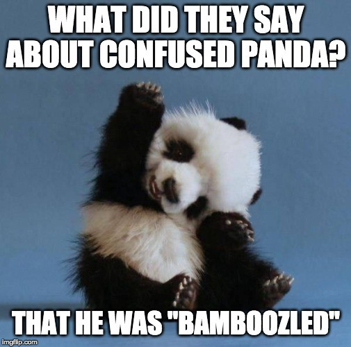

**மொழி**

பல பொருள் குறித்த சொல்லை ஒரு தொடரில் பயன்படுத்தும் பொழுது குழப்பங்கள் ஏற்படுவது உண்டு.  Natural Language Processing (NLP) எனப்படும் இயற்கை மொழி கணினியியல் துறையிலும் ஆழக்கற்றல் துறையிலும் இதனால் அதிக குழப்பம் ஏற்படுகிறது.

தமிழ் இலக்கியத்தில் வினை, சார்பு, இனம், இடம் என்பனவற்றைக் குறிக்கும் சொற்களைச் சேர்த்துச் சொல்லி அதன் பொருளைத் தெளிவு படுத்துவார். 

So, to reduce confusion, let’s start with answering a few basic questions to clarify some concepts before we go in too deep into NLP and Deep Learning. 
Clarifying Questions that you may have been reluctant to ask!
 

First, what is Data Mining? 
How is it different from Data Analytics?
Data mining is, in essence, a set of mathematical and computational techniques that are applied on data stored in databases.  It can help you discover things like “middle-aged working men with careers more than 25 years and hold cricket channel subscriptions are more likely to vote for an independent candidate in an election than those who don’t have cricket channel subscriptions”.  Aside: Don’t take this for a fact, people! I just made this up.
  

Data mining is primarily focused on “structured” data. This means for the “cricket subscriber” example quoted earlier, you need to have:
•	One table (think spreadsheet with rows and columns) in a database (think workbook with a bunch of spreadsheets in it) with columns that identify 
o	who’s working 
o	for how long 
o	their gender 
o	their salary ranges 
•	Another table that tells who has cricket channel subscriptions
•	A third table that tells you which members of a (random) sample population told the surveyor that they would/wouldn’t consider voting for conservative candidate in a local election.   
So, in essence, Data mining is the science of figuring out what things are related e.g., Cricket Channel subscription informing willingness to vote for a Conservative Candidate, and what things aren’t related e.g., buying a Harley informing willingness/unwillingness to vote for a particular candidate in an election–among thousands of such variables.  
 
Doing data mining work requires skills like knowing particular kinds of math, understanding how to sample a population, using specialized software to do complicated calculations in a way that is time-efficient—stuff like that.   
With data mining, you have databases and tables with well-defined data and descriptions of data (called meta-data). So, you clearly know what everything is. Hence you are dealing with “structured data” (by “you,” I mean a computer program).  

So, while Data Mining is a set of tools and techniques used to make data better for use, Data Analytics typically helps in developing and working on models for taking business decisions. Which is why data mining is focused more on computational, mathematical and scientific concepts while data analytics uses extensive business insight and expert knowledge to assist data driven business decision making.
 
A more obvious difference is the lack of emphasis on data visualization in data mining whereas, in data analytics. Information visualization is a field of study in and of itself filled with pioneers like Edward Tufte who have dedicated their lives to marrying art, science, data and design to truly bring out the power of “seeing things in context” in all information we encounter. 
    
 
So, how is Data Mining different from Data Science?
We have now established that Data Mining is about finding patterns in a data set (historical data) using a set of mathematical or statistical techniques and using these patterns to assist knowledge discovery. 

Data Science is much broader in scope. It is an entire field of study which includes Big Data, Data Analytics, Data Mining, Predictive Modeling, Data Visualization, Mathematics, Statistics and AI. Data Science is now considered a paradigm shift in the way we do Science itself. 

   

Data Science is now referred to as the fourth paradigm of Science (the other three being Theoretical, Empirical and Computational). Data Science is an area of extensive, active research and development both in Academia and in Industry. The following figure illustrates the differences between Data Science and Data mining.

 

What is Text Mining and how is it different from Text Analytics and Data Mining?
In data mining, you typically have databases, and know what everything is.  In “text mining,” or “text data mining,” as some people call it (boo!), you have texts, and you don’t know what anything is ( you = computer program). 
This is usually talked about as a difference between “structured” data (i.e., the database)–you know what everything “is”–what it “means”–in some sense, its semantics and “unstructured” data: that’s typically how we would describe text.   
With text, you don’t know what anything means i.e. you don’t know its semantics. To put it another way, there is nothing in the data itself that tells you what each word means or is about. There is very little or no meta-data. Thus, Text Mining could be thought of as turning unstructured data into structured data.   
If you’ve got a bunch of text and you want to structure it to populate an Oracle database?  Well, Text Mining could be the answer. Maybe you have 23 bejillion (made up number!) journal articles in the National Library of Medicine, and you want to find every statement that those 23 bejillion articles make about which genes are affected by which drugs; Again, Text Mining can come to your rescue! Or, maybe you have a huge collection of folk tales, and you want (the computer) to find every time that a stepmother is mentioned and whether the portrayal of the stepmother is positive or negative. Text Mining save me!
You can see that all these scenarios are actually, examples of transforming unstructured data into structured data–you’re taking that unstructured data and using it to build a database about drugs and proteins, or a database about stepmothers.  So, you can see the term “text mining” is more appropriate than “text data mining” as “data mining” is about structured data and it does not make much sense to talk about “data mining” with respect to language.  In fact, Text mining most times, feeds data mining algorithms.  
Now, while data mining people need to know math, text mining folks need to know math and something about what and the language in which people write about an area of interest (say, neuroscience or cricket).  They don’t need to be linguistics professionals, but they need to know enough about the language in general to write programs that answer practical questions, deliver value, pay the bills, and possibly, make the world a better place!  

Let's bring all this together with a SMS ( ) example. Suppose you have a log file that contains your outgoing phone calls and SMS data in the following format:
   
In the log table shown above, 
1.	The first two fields (Field 1 and Field 2) represent the date and time at which a call was made, or a message was sent
2.	The third field represents the type of data. If the person made a voice call, then the value for this field will be set to voice_call. If the person sent a text message, the value of this field will be set to sms. 
3.	The fourth field is for the phone number and name of the contact. If the number of the person is not in the contact list, then the name value will be left blank. 
4.	The last field is for the duration of the call or text message. If the type of the data is voice_call, then the value in this field will be the duration of that call. 
If the type of data is sms, then the value in this field will be the text message. For e.g., the following figure shows records of call data stored in a text file: 
   
 Now, the text log data shown in the preceding figure is not exactly human language, but it does contain various bits of information that can be extracted using text mining. A couple of questions that can be answered by running some simple text mining programs and then querying this data in a database could be: 
•	How many New Year greetings were sent by SMS on the 1st January? 
•	How many people were contacted whose name was not in the contact list? 
At this point, before we move on to Text Analytics, let’s define the term “Analysis”. Analysis is an examination of structure, composition, and meaning that provides insight to advance some purpose.  Text Analysis all about extracting useful insights based on the examination of the structure, composition and meaning of text.  Analysis is typically heuristic, informal, and/or qualitative. Analytics on the other hand is typically algorithmic. 
Thus, Analytics in general can be defined as the formal, repeatable, systematic application of algorithmic, numerical and statistical methods to derive and deliver quantitative information, whether in the form of indicators, tables, or visualizations. 
Text Analytics is then defined as the formal, repeatable, systematic application of algorithmic, numerical and statistical methods to derive and deliver quantitative information on text data.  

In popular usage, the terms “text analytics” and “text mining” are used interchangeably. They both refer to the same set of methods, software tools, and applications. Distinctions in usage stems primarily from the background of the person using each — “text mining” seems most used by data miners, and “text analytics” by individuals and organizations in domains where the road to insight is paved by business intelligence tools and methods — so that the difference is largely a matter of “dialect”. 

What is Natural Language Processing and how is it different from Text Analytics or Text Mining?
It is true that Linguistics professionals have a slightly different definition of Text Analytics (surprise!). They typically state that formally, Text Analytics actually does deal with language but is typically heuristic, light on semantics (meaning) and brittle (i.e. deals poorly with any kind of change; syntactic or semantic e.g., change of dialect).  
NLP on the other hand deals with language too but is all about semantics, is robust, adaptable and is not restricted to text data. Voice (speech) recognition and analysis also come under the domain of NLP.
Natural language means human language (as opposed to computer languages).  Natural language processing is all about building tools to handle specific linguistic tasks–parse a sentence, figure out parts of speech, stuff like that.  You might use a combination of different language processing programs to do a text mining task.  The questions are less about some set of facts. They are about the language itself!   

While the data mining person needs to know math, the text mining person needs to know math and how people write about genes and drugs, or stepmothers, or whatever the topic of interest is. 
The natural language processing person needs to know something about language–what kinds of structures sentences can have, how word frequencies are distributed, how to build linguistic resources for letting a computer, process things that can’t be directly observed (viz. semantics).  
Consider this simple yet tricky example: How do you get a software program to recognize that Mr. Rangarajan, K. Rangarajan and Keshava Rangarajan are all referring to the one thing in the real world, whereas Mrs. Rangarajan and Kei Rangarajan are referring to something else in the real world even though all of them have Rangarajan in them? Aside: this is called coreference resolution. This figure illustrates the example:
  

This is just a Nader meme; not a reference to coreference resolution! (or is it?)

 Recognizing that those “things” or entities in the world are people, as opposed to, say, locations, or companies, is a whole different activity (called Named Entity Recognition). 
  

So, NLP is that branch of artificial intelligence that deals with the interaction between computers and humans using natural language. The ultimate objective of NLP is to read, decipher, understand, and make sense of human languages in a manner that is valuable. As expected, classic NLP techniques rely on Machine Learning. More recently Deep Learning is being employed extensively to derive meaning.

  

What Is Natural Language Understanding (NLU)?
Natural Language Understanding is a part of Natural Language Processing. Once a body of text has been broken down structurally (syntactically) into digestible bits, it’s possible for a program to find meaning by analyzing it (say, for sentiment). So syntactically, it breaks down text into parts of speech, sentence structure, and morphemes (the smallest understandable part of a word).   NLU then looks for the true meaning behind the words by comparing them to similar examples i.e. semantic analysis.  
Unlike structured data, human language is structurally messy and ambiguous. We are rarely precise or straightforward our communication. Grammar and the meaning of words are highly contextual. 
 
When you ask your phone something like “What’s I-93 like right now?”, if you were being literal, you might get an answer like, “It’s long, gray, and has cars driving on it. It was recently paved between exits 36 and 42.” But in reality, you want to know what the traffic conditions are on I-93. That’s where NLU comes in. It takes the slangy, figurative, highly contextual way we talk every day and understanding what we “really” mean by it. 
   

What is Natural Language Generation (NLG)?
Now, once a chatbot, a smart device, or search engine understands the language it’s “hearing,” it has to talk back in a way that you, in turn, will understand. That’s where NLG comes in. NLG takes results from, say, a search result, and turns it into understandable language. 
So, whenever you ask your smart device, “What’s it like on I-93 right now?” it can answer almost exactly as another human would. It may say something like, “There is an accident at exit 36 that has created a 15-minute delay,” or “The road is clear.” NLG is used in chatbot technology. In fact, chatbots have become so advanced that you may not even know you’re talking to a machine. 
 
NLG presents a great business opportunity to industry. Using NLP, NLG, and machine learning in chatbots frees up resources and allows companies to offer 24/7 customer service without having to staff a large department. 
  NLG can also be used to create data-based content at scale. If you produce templated content regularly, say for example, a story based on the Labor Department’s jobs report, you can use NLP to analyze the data, NLU to comprehend the content and NLG to write a basic narrative based on the numbers.
 So, summarily, NLP, NLU and NLG tackle different parts of the conversational AI problem. 
 

What Is the Difference Between NLP, NLU, and NLG?
NLP, NLU, and NLG all play a part in teaching machines to think more like humans. They simply tackle different parts of the conversational AI problem. How do you get machines to recognize, understand, and generate natural language? How do you use it to answer search queries and create content at scale?
  

Let’s take a specific example to illustrate just how these functions work together. You get home from work wonder about the stock market. 
  So, you ask your smart device, “Hey Google, how did the stock market do today?” Your Google Home device listens to your query and invokes an NLP program. That program takes your question text and breaks it down into understandable pieces – “stock market” and “today” being keywords on which it focuses. It then invokes another program that compares your query to similar queries made to Google by others and tries to understand what you’re asking. The bot then uses an NLU program to understand that what you are asking for is today’s closing numbers for NASDAQ, Dow Jones and the S&P 500. It then invokes a program that searches the web for content that best answers your question. That is semantic search in action. Once it has results from a reliable source (say Bloomberg), it pulls out the results and invokes an NLG program to deliver a response to you in natural language. The answer could be something like, “According to Bloomberg, the NASDAQ was down 1.5 points, but the Dow was up 77, and the S&P was up 5 points”. You probably will follow up and ask questions about specific stocks you own, and the process starts all over again!  
The great thing about machine learning is that, if you ask these questions regularly, your smart device will catch on to the pattern and start anticipating your questions, giving you your stock numbers along with the overall market numbers at the same time without you having to specifically ask for it! Cool!
What Is the value of NLP (therefore for NLU, and NLG)?
 
This one’s easy. Industry examples of NLP use are all around us. For e.g., 
Document Classification: using the language within a document (e.g., an email, a Tweet, or a review of a film) to classify it into a particular category (e.g., high urgency, positive sentiment) or predicted direction of the price of a company’s stock based on an analyst’s report. 
Machine translation: assisting language-translation firms with machine-generated suggestions from a source language (e.g., English) to a target language (e.g., Thamizh, German or Mandarin); increasingly, fully automatic— though not always perfect— translations between languages.
 
 Search engines: autocompleting users’ searches and predicting what information or website they’re seeking.  

Speech recognition: interpreting voice commands, converting it to text to provide information or take action, as with virtual assistants like Amazon’s Alexa, Apple’s Siri, or Microsoft’s Cortana.   

Chatbots: carrying out a natural conversation for an extended period of time; though this is seldom done convincingly today, they are nevertheless helpful for relatively linear conversations on narrow topics such as the routine components of a firm’s customer-service phone calls. 
  

Are real world NLP Applications complex to build?
Truly, it depends. 
•	The easiest NLP applications to build are spell checkers, synonym suggestion engines, and keyword-search based query tools. These tasks can be solved in a fairly straightforward fashion with deterministic, rules-based code using, say, reference dictionaries or thesauruses.  Deep learning models are unnecessarily sophisticated for these applications. 
•	Intermediate-complexity NLP applications include assigning a school-grade reading level to a document, predicting the most likely next words while making a query in a search engine aka autocomplete, classifying documents, and extracting information like prices or named entities from documents or websites. These intermediate NLP applications are well suited to solving with deep learning models.  Later we will leverage a variety of deep learning architectures to predict the sentiment of film reviews. Named entities include places, well-known individuals, company names, and products.  
•	The most sophisticated NLP applications are found in machine translation, automated question-answering, and chatbots.   These are complex because they need to handle application-critical nuances (as an example, humor is particularly transient), a response to a question can depend on the intermediate responses to previous questions and meaning can be conveyed over the course of a lengthy passage of text consisting of many sentences.  

But then, what is Computational Linguistics?
Okay, so this a bit complex. Computational Linguistics uses computational models to test theories about language.   
Though it seems abstract, this is an area of enormous promise. It’s also the hardest to master (even harder to pay bills with if you are not really “up there” in terms of knowing the techniques, the technology and how to drive applications of it for business benefit)!  A lot of effort is being invested these days to model the semantics of specific areas or domains (medicine being a big one, law being another).  
Consider, for example, the language used by experts in the biomedical domain.  Clearly, we know that there are differences in the semantic primitives of a biomedical language i.e. the language used by experts in the biomedical domain versus “general” English (or any other language used for general communication).  
By building a large set of data-driven semantic representations of predicates (the part of a sentence containing a verb stating something about the subject viz. went home in John went home) found in journal articles related to the biomedical domain, we can compare that resource to a similar resource built for general English and look for things like, whether or not the semantic primitives seem to come from the same set, whether or not given verbs have different representations in the two types of language, etc.  Essentially, information about the use of language in a particular domain. The hope here is to get a sense of the range of types of semantic variability.  
The insights from this (computational linguistics) work could then be used to design and build NLP tools that could then be used to carry out domain specific, practical text mining tasks like, say, in the biomedical domain “for fun and profit”!  
And now, a brief foray into the history of NLP  
Okay, by now you and I are settled with the fact that we’re in the middle of an NLP revolution! Voice and text interactions between humans and machines are commonplace today. Huge advances in machine learning over the past decade have made vast improvements in speech recognition and machine translation software in the recent past. Language generators today are now good enough to write coherent news articles! Virtual agents like Siri, Alexa and Google are now an indispensable part of our daily lives.
In an earlier chapter, we introduced the high-level theory of deep learning via analogies to the biological visual system. We highlighted the fact that one of the deep learning technique’s core strengths lies in its ability to learn features automatically from data. In this chapter, we build atop those deep learning foundations by examining how deep learning is incorporated into human language applications, with a particular emphasis on how deep learning can automatically learn features that represent the meaning of words. But before all that it is critical to understand how we got here!
A meaningful look into the history of natural language processing
  In 1953, the Austro-British philosopher Ludwig Wittgenstein famously argued, in his posthumous, seminal work Philosophical Investigations, “The meaning of a word is its use in the language.” that, “One cannot guess how a word functions; One has to look at its use and learn from that.” Wittgenstein was suggesting (radically, at that time) that words on their own have no real meaning! It was by their use within the larger context of that language that we’re able to ascertain their meaning i.e. meaning is created or generated from use!  
 

Alan Turing, the father of modern computer science, engaged with Wittgenstein on the connections between language, mathematics, computers and artificial intelligence. They influenced one another; Wittgenstein with his mathematical philosophies, Turing with his computational science practicality and his desire to create machines that could converse with humans.

  Machine-generated language today is regarded by most as a digital phenomenon and a central goal of artificial intelligence (AI) research at the same level as Machine Vision. People today tend to trace the origins of NLP back to the beginning of the modern computer age, when Alan Turing, writing in 1950, imagined a smart machine that could comprehend (NLU), respond (NLG) and thus interact fluently with a human via typed text (NL) on a screen leading to the notion of a “Turing Test”.
  But the fact is that attempts to articulate, design formal rules and machines that could analyze, process, and generate language go back thousands of years! While specific technologies have changed over time, the basic idea of treating language as a material that can be structured and hence (artificially) manipulated by rule-based systems has been pursued by many people in many cultures and for many different reasons at many points in time.  These historical experiments reveal the promise and perils of attempting to simulate human language in non-human ways—and some even hold lessons for today’s practitioners of cutting-edge NLP techniques. 

  The earliest and probably one of the greatest successes a constructive approach to the description of a natural language has ever had was when Dakshiputra Panini (400 – 350 BCE) devised his grammar for the Sanskrit language. This achievement was termed by the famous linguist Leonard Bloomfield as "one of the greatest monuments of human intelligence" (unlike this meme).  

The late Dr. Frits Staal department founder and Emeritus Professor of Philosophy and South/Southeast Asian Studies at the University of California, Berkeley argued that ancient Indian grammarians, especially Pāṇini, had mastered methods of linguistic theory not rediscovered again until the 1950s and the applications of modern mathematical logic to linguistics by Noam Chomsky (Chomsky too agrees that the first generative grammar in the modern sense was Panini's grammar). 
  These early methods allowed the construction of discrete, potentially infinite generative systems.  Remarkably, these early linguistic systems were codified orally, though writing was then used to develop them in some way. The formal basis for Panini's methods involved the use of "auxiliary" markers, rediscovered in the 1930s by the logician Emil Post whose rewrite system form the basis for the description of computer languages.  

The ancient discoveries were motivated by the need to preserve exact Sanskrit pronunciation and expression given the primacy of language in ancient Indian thought. So we would expect that the insights of Panini, described by Staal as "the greatest linguist of antiquity, if not of all time" could be exploited to help answer questions regarding limits to computers as well as to define an approach that could yield powerful text and speech processing systems. 

The knowledge representation methodology in the grammar of Panini and his successors is in many ways equivalent to the more powerful, currently researched artificial intelligence (AI) schemes. Furthermore, it includes rules about rules, analogs of which are not known for any other language (or for a flexible enough subset of, say, the English language), which would help in the writing of efficient AI software.

 In the late 1200s, Abraham Abulafia, a Jewish mystic began combining the letters of the Hebrew alphabet in seemingly random ways (Aleph with Bet, Bet with Gimmel, Gimmel with Aleph and Bet, and so on) calling it “the science of the combination of letters.” He wasn’t combining letters at random but was following a (secret) set of rules that he had devised while studying an ancient Kabbalistic text called the Sefer Yetsirah. 
The book described how God created “all that is formed and all that is spoken” by combining Hebrew letters according to sacred formulas. In one section, God exhausts all possible two-letter combinations of the 22 Hebrew letters.
After studying the Sefer Yetsirah, Abulafia concluded that linguistic symbols could, in theory, be manipulated with formal rules. These could then create new, interesting & possibly insightful sentences. He spent months generating thousands of combinations of the 22 letters of the Hebrew alphabet and eventually emerged with a series of books that he claimed were endowed with prophetic wisdom.  

For Abulafia, generating language according to these rules offered insight into the sacred and the unknown, or as he put it, allowed him to “grasp things which by human tradition or by thyself thou would not be able to know.” But other Jewish scholars considered this rudimentary language generation effort a dangerous act that bordered on the profane! The Talmud is rife with stories of rabbis who, by the magical act of permuting language according to the formulas set out in the Sefer Yetsirah, created artificial creatures called golems. In these tales, rabbis manipulated the letters of the Hebrew alphabet to replicate God’s act of creation, using the sacred formulas to imbue inanimate objects with life.
In some of these myths, the rabbis used this skill for practical reasons, to make animals to eat when hungry or servants to help them with domestic duties. But many of these golem stories end badly. 
 

This “science of the combination of letters” clearly was a rudimentary form of natural language processing, as it involved combining letters of an alphabet according to specific rules. It was viewed as a double-edged sword: a way to access new forms of knowledge and wisdom, but also an inherently dangerous practice that could bring about unintended consequences. 
This tension has been a constant factor throughout the long history of language processing. It still figures in discussions about the most cutting-edge NLP technology of our era.
In 1666, the German polymath Gottfried Wilhelm Leibniz published an enigmatic dissertation entitled On the Combinatorial Art. Though only 20 years old, Leibniz outlined a theory for automating knowledge production via the rule-based combination of symbols.
   
Gottfried Wilhelm Leibniz and his dissertation “On the Combinatorial Art”

 
Leibniz’s central thesis was that all human thought was (no matter how complex), a combination of basic and fundamental concepts in much the same way that sentences are combinations of words, and words combinations of letters. 
Furthermore, Leibniz believed that if he could find a way to symbolically represent these fundamental concepts and develop a method by which to combine them logically, then he would be able to generate new thoughts on demand (sounds familiar?).
Ostensibly, the idea came to Leibniz through his study of Ramon Llull, a 13th century Majorcan mystic who devoted himself to devising a system of theological reasoning that would prove the “universal truth" of Christianity to non-believers.  
Llull himself was inspired by Jewish Kabbalists’ letter combinatorics which they used to produce generative texts that ostensibly revealed prophetic wisdom. Llull subsequently invented (what he called) a volvelle, a circular paper mechanism with increasingly small concentric circles on which were written symbols representing the attributes of God. Llull believed that by spinning the volvelle in various ways, bringing the symbols into novel combinations with one another, he could reveal all the aspects of his deity.

  Leibniz, impressed by Llull’s machine embarked on a project to create his own method of idea generation through symbolic combination! But his machine was not for theological debate. It was for philosophical reasoning! According to him, such a system would require: 
•	An “alphabet “of human thoughts
•	A list of logical rules for their valid combination and re-combination 
•	A device that could carry out the logical operations on the symbols quickly and accurately—a mechanized version of Llull’s volvelle. 
Leibniz argued that this machine, dubbed “the great instrument of reason,” could answer all questions and resolve intellectual debate. “When there are disputes among persons,” he wrote, “we can simply say, ‘Let us calculate,’ and without further ado, see who is right.” This notion of a mechanism that produced rational thought based on logical operations on an alphabet of concepts reflects the creative optimism of his time! 
Other Enlightenment thinkers, such as René Descartes, believed that there indeed was a “universal truth” that could be accessed through reason alone, and that all phenomena were fully explainable if the underlying principles were understood. Leibniz also believed that the same, was true of language and cognition.
   
But many others saw this doctrine of pure reason as deeply flawed and felt that it signified a new age sophistry! (i.e. clever but deliberately misleading).   
One such critic was the author and satirist Jonathan Swift, who took aim at Leibniz’s thought-calculating machine in his 1726 book, Gulliver’s Travels. In it, Gulliver visits the Grand Academy of Lagado where he encounters a strange mechanism called “the engine.”   Which had a large wooden frame with a grid of wires; on the wires were small wooden cubes with symbols written on each side.

 
Grand Academy of Lagado (Gulliver’s Travels)

The students of the Grand Academy of Lagado crank handles on the side of the machine causing the wooden cubes to rotate and spin, bringing the symbols into new combinations. A scribe then writes down the output of the machine, and hands it to the presiding professor. Through this process, the professor claims, he and his students can “write books in philosophy, poetry, politics, laws, mathematics, and theology, without the least assistance from genius or study.”

This scene, with its pre-digital language generation, was Swift’s parody of Leibniz’s thought generation through symbolic combinatorics—and more broadly, an argument against the primacy of science (Aside: Other ideas, for e.g. universal language were also parodied by Jonathon Swift in part of Gulliver’s Travels where he writes of a land where people have dispensed with words entirely, and instead carry around the actual objects they wish to refer to in conversation).  

Swift’s point was that language is not a formal, well-structured system that represented human thought, as Leibniz proposed. Instead it was a messy and ambiguous form of expression. It made sense only in relation to the context in which it is used. Swift argued that a machine capable of generating language required more than having the right set of rules and the right mechanisms, it needed to possess the ability to understand the meaning of words, something that neither the Lagado engine nor Leibniz’s “instrument of reason” could do.
In the end, Leibniz never constructed his idea-generating machine. In fact, he abandoned the study of Llull’s combinatorics altogether, and, later in life came to see his pursuit of mechanizing language as immature. But the idea of using mechanical devices to perform logical functions remained with him, inspiring the construction of his ‘step reckoner,’ a mechanical calculator in 1673.  
Today as natural language processing gets increasingly realistic, debates echoing the ideas of Leibniz and Swift are resurfacing i.e. Even if you can create a formal system to generate human-seeming language, can you bestow the system with the ability to understand what it’s saying?

   In 1913, the Russian mathematician Andrey Andreyevich Markov manually wrote out the first 20,000 letters of the Alexander Pushkin’s 19th century verse novel, Eugene Onegin, as one long string of letters, eliminating all punctuation and spaces! He then arranged these letters in 200 grids (10-by-10 characters each), counted the vowels in every row and column and tallied the results in order to comprehend the text’s underlying mathematical structure and potentially model it! 

By separating vowels from consonants, Markov was actually testing a theory of probability that he had been developing since 1909. Up until that point, the field of probability had been mostly limited to analyzing phenomena like roulette or coin flipping, where the outcome of previous events did not change the probability of current events. But Markov felt that most things happen in chains of causality and are dependent on prior outcomes. He wanted a way of modeling these occurrences through probabilistic analysis.
    

Language, Markov believed, was an example of a system where past occurrences partly determine present outcomes. He showed that in a text like Pushkin’s novel, the chance of a certain letter appearing at some point in the text is dependent, to some extent, on the letter that came before it. Markov
•	Counted vowels in Eugene Onegin, and found that 43 percent of letters were vowels and 57 percent were consonants 
•	Separated the 20,000 letters into pairs of vowels and consonant combinations and found that there were 1,104 vowel-vowel pairs, 3,827 consonant-consonant pairs, and 15,069 vowel-consonant and consonant-vowel pairs etc.
What this demonstrated, statistically speaking, was that for any given letter in Pushkin’s text, if it was a vowel, odds were that the next letter would be a consonant, and vice versa.  Markov used this analysis to demonstrate that Pushkin’s Eugene Onegin wasn’t a random distribution of letters but had some underlying statistical qualities that could be modeled. 
The research paper that came out of his work, “An Example of Statistical Investigation of the Text Eugene Onegin Concerning the Connection of Samples in Chains,” was not widely cited in Markov’s lifetime, and not translated to English until 2006! But some of its central concepts around probability and language spread across the globe, eventually finding re-articulation in Claude Shannon’s hugely influential paper, “A Mathematical Theory of Communication,” which came out in 1948. 
   
Shannon’s paper outlined a way to precisely measure the quantity of information in a message and set the foundations for a theory of information that would come to define the digital age. Shannon was drawn by Markov’s idea that in a given text, the likelihood of some letter or word appearing could be approximated. 
Like Markov, Shannon demonstrated this by performing some textual experiments that involved making a statistical model of language, then took this a step further by using the model to generate text according to those statistical rules. In an initial control experiment, he started by generating a sentence by picking letters randomly from a 27-symbol alphabet (26 letters, plus a space), and got the following output:
XFOML RXKHRJFFJUJ ZLPWCFWKCYJ FFJEYVKCQSGHYD QPAAMKBZAACIBZLHJQD
The sentence was meaningless noise as Shannon expected given, when communicating, we don’t choose letters with equal probability due to language syntax and semantics. As Markov had shown, consonants are more likely than vowels but at a greater level of granularity. E’s are more common than S’s which are more common than Q’s. So, to account for this, Shannon amended his original alphabet so that it modeled the probability of English more closely—he was 11 percent more likely to draw an E from the alphabet than a Q. When he again drew letters at random from this recalibrated corpus he got a sentence that came a bit closer to English!
OCRO HLI RGWR NMIELWIS EU LL NBNESEBYA TH EEI ALHENHTTPA OOBTTVA NAH BRL.
In a series of subsequent experiments, Shannon demonstrated that as you make the statistical model even more complex, you get increasingly more comprehensible results. Thus Shannon, via Markov, revealed a statistical framework for the English language. He showed that by modeling this framework i.e. by analyzing the dependent probabilities of letters and words appearing in combination with each other—he could actually generate language like:
THE TIME OF WHO EVER TOLD THE PROBLEM FOR AN UNEXPECTED

The more complex the statistical model of a given text, the more accurate the language generation becomes—or as Shannon put it, the greater “resemblance to ordinary English text.” In the final experiment, Shannon drew from a corpus of words instead of letters and achieved the following:
THE HEAD AND IN FRONTAL ATTACK ON AN ENGLISH WRITER THAT THE CHARACTER OF THIS POINT IS THEREFORE ANOTHER METHOD FOR THE LETTERS THAT THE TIME OF WHO EVER TOLD THE PROBLEM FOR AN UNEXPECTED.
Both, for Shannon and for Markov, the insight that language’s statistical properties could be modeled offered a way to re-think broader problems that they were working on. For Markov, it extended the study of stochasticity beyond mutually independent events, paving the way for a new era in probability theory.  For Shannon, it helped him formulate a precise way of measuring and encoding units of information in a message, which revolutionized telecommunications and, eventually, digital communication. 
   

Their statistical approach to language modeling and generation also ushered in a new era for natural language processing, which continues to impact digital communications to this day!
Then, Joseph Weizenbaum, a German American computer scientist at MIT’s artificial intelligence lab, moved the needle further and developed the first-ever chatbot between 1964 and 1966!
  

There were some rudimentary digital language generation programs in existence (programs that could generate “somewhat” coherent lines of text), but Weizenbaum’s program was the first one designed explicitly for interactions with humans i.e. the user could type in some statement or set of statements in their normal language, press enter, and receive a response from the machine. Per Weizenbaum, the program made “certain kinds of natural-language conversation between man and computer possible.”
He named the program Eliza after Eliza Doolittle, the working-class heroine of George Bernard Shaw’s Pygmalion who learns how to talk with an upper-class accent and fools people. The new Eliza was written for the 36-bit IBM 7094, an early transistorized mainframe computer, in a programming language that Weizenbaum developed called MAD-SLIP.
Because computer time was a valuable resource, Eliza could only be run via a time-sharing system i.e. the user interacted with the program remotely via an electric typewriter and printer. When the user typed in a sentence and pressed enter, a message was sent to the mainframe computer. Eliza scanned the message for the presence of a keyword and used it in a new sentence to form a response that was sent back, printed out, and read by the user.
To encourage ongoing dialogue, Weizenbaum designed Eliza to simulate the type of conversational style used by a Rogerian psychoanalyst. So, the program would take something the user said and reflect it back with a question, as seen in the example below. (Notice how the program takes keywords like “boyfriend” and “depressed” and re-uses them.)
    

Weizenbaum chose this mode of dialogue for Eliza because it gave the impression that the computer understood what was being said without having to offer anything new to the conversation. It created the illusion of comprehension and engagement in a mere 200 lines of code.
To test Eliza’s capacity to engage an interlocutor, Weizenbaum invited students and colleagues into his office and let them chat with the machine while he looked on. He noticed, with some concern, that during their brief interactions with Eliza, many users began forming emotional attachments to the algorithm. They would open up to the machine and confess problems they were facing in their lives and relationships.
Even more surprising was that this sense of intimacy persisted even after Weizenbaum described how the machine worked and explained that it didn’t really understand anything that was being said. Weizenbaum was most troubled when his secretary, who had watched him build the program from scratch over many months, insisted that he leave the room so she could talk to Eliza in private.
For Weizenbaum, this experiment with Eliza made him question an idea that Alan Turing had proposed in 1950 about machine intelligence. In his paper, entitled “Computing Machinery and Intelligence,” Turing suggested that if a computer could conduct a convincingly human conversation in text, one could assume it was intelligent—an idea that became the basis of the famous Turing Test.
But Eliza demonstrated that convincing communication between a human and a machine could take place even if comprehension only flowed from one side: The simulation of intelligence, rather than intelligence itself, was enough to fool people. Weizenbaum called this the Eliza effect, and believed it was a type of “delusional thinking” that humanity would collectively suffer from in the digital age. This insight was a profound shock for Weizenbaum, and one that came to define his intellectual trajectory over the next decade.
In 1976, he published Computing Power and Human Reason: From Judgment to Calculation, which offered a long meditation on why people are willing to believe that a simple machine might be able to understand their complex human emotions.
In this book, he argues that the Eliza effect signifies a broader pathology afflicting “modern man.” In a world conquered by science, technology, and capitalism, people had grown accustomed to viewing themselves as isolated cogs in a large and uncaring machine. In such a diminished social world, Weizenbaum reasoned, people had grown so desperate for connection that they put aside their reason and judgment in order to believe that a program could care about their problems.
Weizenbaum spent the rest of his life developing this humanistic critique of artificial intelligence and digital technology. His mission was to remind people that their machines were not as smart as they were often said to be. And that even though it sometimes appeared as though they could talk, they were never really listening.
In March 2016, Microsoft was preparing to release its new chatbot, Tay, on Twitter.  

Described as an experiment in “conversational understanding,” Tay was designed to engage people in dialogue through tweets or direct messages, while emulating the style and slang of a teenage girl. She was, according to her creators, “Microsoft’s A.I. fam from the Internet that’s got zero chill.” She loved E.D.M. music, had a favorite Pokémon, and often said extremely online things, like “swagulated.”
Tay was an experiment at the intersection of machine learning, natural language processing, and social networks. While other chatbots in the past—like Joseph Weizenbaum’s Eliza—conducted conversation by following pre-programmed and narrow scripts, Tay was designed to learn more about language over time, enabling her to have conversations about any topic.
We know Machine learning works by developing generalizations from large amounts of data. In any given data set, the algorithm will discern patterns and then “learn” how to approximate those patterns in its own behavior. So, using this technique, engineers at Microsoft trained Tay’s algorithm on a dataset of anonymized public data along with some pre-written material provided by professional comedians to give it a basic grasp of language. The plan was to release Tay online, then let the bot discover patterns of language through its interactions, which she would emulate in subsequent conversations. Eventually, her programmers hoped, Tay would sound just like the Internet. 
On March 23, 2016, Microsoft released Tay to the public on Twitter. At first, Tay engaged harmlessly with her growing number of followers with banter and lame jokes. 
 
But after just a few hours, Tay started tweeting highly offensive messages. Within 16 hours of her release, Tay had tweeted more than 95,000 times, and a troubling percentage of her messages were abusive and offensive. 
Twitter users started registering their outrage, and Microsoft had little choice but to suspend the account. What the company had intended on being a fun experiment in “conversational understanding” had become their very own golem, spiraling out of control through the animating force of language.
Over the next week, many reports emerged detailing precisely how a bot that was supposed to mimic the language of a teenage girl became so vile. It turned out that just a few hours after Tay was released, a post on the troll-laden bulletin board, 4chan, shared a link to Tay’s Twitter account and encouraged users to inundate the bot with racist, misogynistic, and anti-semitic language.
In a coordinated effort, the trolls exploited a “repeat after me” function that had been built into Tay, whereby the bot repeated anything that was said to it on demand. But more than this, Tay’s in-built capacity to learn meant that she internalized some of the language she was taught by the trolls and repeated it unprompted. 
The coordinated attack on Tay worked better than the 4channers expected and was discussed widely in the media in the weeks after. Some saw Tay’s failure as evidence of social media’s inherent toxicity, a place that brings out the worst in people and allows trolls to hide in anonymity. For others, though, Tay’s behavior was evidence of poor design decisions on Microsoft’s behalf.
Zoë Quinn, a game developer and writer who’s been a frequent target of online abuse, argued that Microsoft should have been more cognizant of the context in which Tay was being released. If a bot learns how to speak on Twitter—a platform rife with abusive language—then naturally it will learn some abusive language. Microsoft, Quinn argued, should have planned for this contingency and ensured that Tay was not corrupted so easily. “It’s 2016,” she tweeted. “If you’re not asking yourself ‘how could this be used to hurt someone’ in your design/engineering process, you’ve failed.”
Months after taking Tay down, Microsoft released Zo, a “politically correct” version of the original bot. Zo, who was active on social networks from 2016 to 2019, was designed to shut down conversations about certain contentious topics, including politics and religion, to ensure she didn’t offend people. (If a correspondent kept pressing her to talk about a certain sensitive topic, she left the conversation altogether, with a sentence like: “im better than u bye.”) 
 
The lesson Microsoft learned the hard way is that designing computational systems that can communicate with people online is not just a technical problem, but a deeply social endeavor. Inviting a bot into the value-laden world of language requires thinking, in advance, about what context it will be deployed in, what type of communicator you want it to be, and what type of human values you want it to reflect. As we move towards an online world in which bots are more prevalent, these questions must be at the forefront of the design process. Otherwise there will be more golems released into the world that will reflect back to us, in language, the worst parts of ourselves.

  
Brockman and Ilya Sutskever from OpenAI, who chose not to release their GPT-2 language model to the world.
In February of last year, OpenAI, one of the foremost artificial intelligence labs in the world, announced that a team of researchers had built a powerful new text generator called the Generative Pre-Trained Transformer 2, or GPT-2 for short. The researchers used a reinforcement learning algorithm to train their system on a broad set of natural language processing (NLP) capabilities, including reading comprehension, machine translation, and the ability to generate long strings of coherent text. 
But as is often the case with NLP technology, the tool held both great promise and great peril. Researchers and policy makers at the lab were concerned that their system, if widely released, could be exploited by bad actors and misappropriated for “malicious purposes.”
The people of OpenAI, which defines its mission as “discovering and enacting the path to safe artificial general intelligence,” were concerned that GPT-2 could be used to flood the Internet with fake text, thereby degrading an already fragile information ecosystem. For this reason, OpenAI decided that it would not release the full version of GPT-2 to the public or other researchers.
GPT-2 is an example of a technique in NLP called language modeling, whereby the computational system internalizes a statistical blueprint of a text so it’s able to mimic it. Just like the predictive text on your phone—which selects words based on words you’ve used before—GPT-2 can look at a string of text and then predict what the next word is likely to be based on the probabilities inherent in that text.
 
GPT-2 can be seen as a descendant of the statistical language modeling that the Russian mathematician A. A. Markov developed in the early 20th century. What’s different with GPT-2, though, is the scale of the textual data modeled by the system. Whereas Markov analyzed a string of 20,000 letters to create a rudimentary model that could predict the likelihood of the next letter of a text being a consonant or a vowel, GPT-2 used 8 million articles scraped from Reddit to predict what the next word might be within that entire dataset.
And whereas Markov manually trained his model by counting only two parameters—vowels and consonants—GPT-2 used cutting-edge machine learning algorithms to do linguistic analysis with over 1.5 million parameters, burning through huge amounts of computational power in the process.
The results were impressive. In their blog post, OpenAI reported that GPT-2 could generate synthetic text in response to prompts, mimicking whatever style of text it was shown. If you prompted the system with a line of William Blake’s poetry, it can generate a line back in the Romantic poet’s style. If you prompted the system with a cake recipe, you get a newly invented recipe in response.
Perhaps the most compelling feature of GPT-2 is that it can answer questions accurately. For example, when OpenAI researchers asked the system, “Who wrote the book The Origin of Species?”—it responded: “Charles Darwin.” While only able to respond accurately some of the time, the feature does seem to be a limited realization of Gottfried Leibniz’s dream of a language-generating machine that could answer any and all human questions.
After observing the power of the new system in practice, OpenAI elected not to release the fully trained model. In the lead up to its release in February, there had been heightened awareness about “deepfakes”—synthetic images and videos, generated via machine learning techniques, in which people do and say things they haven’t really done and said. Researchers at OpenAI worried that GPT-2 could be used to essentially create deepfake text, making it harder for people to trust textual information online.
Responses to this decision varied. On one hand, OpenAI’s caution prompted an overblown reaction in the media, with articles about the “dangerous” technology feeding into the Frankenstein narrative that often surrounds developments in AI.
Others took issue with OpenAI’s self-promotion, with some even suggesting that OpenAI purposefully exaggerated GPT-2s power in order to create hype—while contravening a norm in the AI research community, where labs routinely share data, code, and pre-trained models. 
OpenAI stood by its decision to release only a limited version of GPT-2, but has since released larger models for other researchers and the public to experiment with. As yet, there has been no reported case of a widely distributed fake news article generated by the system. But there have been a number of interesting spin-off projects, including GPT-2 poetry and a webpage where you can prompt the system with questions yourself. There’s even a Reddit group populated entirely with text produced by GPT-2-powered bots. Mimicking humans on Reddit, the bots have long conversations about a variety of topics, including conspiracy theories and Star Wars movies.
This bot-powered conversation may signify the new condition of life online, where language is increasingly created by a combination of human and non-human agents, and where maintaining the distinction between human and non-human, despite our best efforts, is increasingly difficult.
The idea of using rules, mechanisms, and algorithms to generate language has inspired people in many different cultures throughout history. But it’s in the online world that this powerful form of wordcraft may really find its natural milieu—in an environment where the identity of speakers becomes more ambiguous, and perhaps, less relevant. It remains to be seen what the consequences will be for language, communication, and our sense of human identity, which is so bound up with our ability to speak in natural language.

DL for NLP  

Armed with this background setting, we now begin by breaking down deep learning for natural language processing (NLP) as a discipline, and then we go on to discuss modern deep learning techniques for representing words and language. 
By the end of the chapter, you should have a good grasp on what is possible with deep learning and NLP, the groundwork for writing such code in subsequent Chapters.  Here we will cover the relevant aspects of these concepts separately, and then we weave them together as the chapter progresses. 
Deep Learning Networks Learn Representations Automatically 
As established earlier, deep learning can be defined as the layering of simple algorithms called artificial neurons into networks several layers deep. Via the Venn diagram in Figure 2.1, we show how deep learning resides within the machine learning family of representation learning approaches. The representation learning family, which contemporary deep learning dominates, includes any techniques that learn features from data automatically. Indeed, we can use the terms “feature” and “representation” interchangeably. 

   

This Venn diagram (the one on the left; Ignore the one on the right…) distinguishes the traditional family from the representation learning family of machine learning techniques and shows the subsets of machine learning namely: "Traditional" machine learning and representation learning. It lays the foundation for understanding the advantage of representation learning relative to traditional machine learning approaches. Traditional ML typically works well because of human-designed code that transforms raw data— whether it be images, audio of speech, or text from documents— into input features for machine learning algorithms (e.g., regression, random forest, or support vector machines) that are adept at weighting features but not particularly good at learning features from raw data directly. This manual creation of features is often a highly specialized task. For working with language data, for example, it might require graduate-level training in linguistics. 
 

The primary benefit of deep learning is that it eases this requirement for subject-matter expertise. Instead of manually curating input features from raw data, one can feed the data directly into a deep learning model. Over the course of many examples provided to the deep learning model, the artificial neurons of the first layer of the network learn how to represent simple abstractions of these data, while each successive layer learns to represent increasingly complex nonlinear abstractions on the layer that precedes it. 
 
As you’ll discover in this chapter, this isn’t solely a matter of convenience; learning features automatically has additional advantages. Features engineered by humans tend to not be comprehensive, tend to be excessively specific, and can involve lengthy, ongoing loops of feature ideation, design, and validation that could stretch for years. Representation learning models, meanwhile, generate features quickly (typically over hours or days of model training), adapt to changes in the data (e.g., new words, meanings, or ways of using language), and adapt automatically to shifts in the problem being solved. 

A Brief History of Deep Learning for NLP 

  The timeline in this figure calls out recent milestones in the application of deep learning to NLP. This timeline begins in 2011, when the University of Toronto computer scientist George Dahl and his colleagues at Microsoft Research revealed the first major breakthrough involving a deep learning algorithm applied to a large dataset.  This breakthrough happened to involve natural language data. Dahl and his team trained a deep neural network to recognize a substantial vocabulary of words from audio recordings of human speech. 
 
George Dahl

A year later, the next landmark deep learning feat also came out of Toronto: AlexNet blowing the traditional machine learning competition out of the water in the ImageNet Large Scale Visual Recognition Challenge.
By 2015, the deep learning progress being made in machine vision began to spill over into NLP competitions such as those that assess the accuracy of machine translations from one language into another. These deep learning models approached the precision of traditional machine learning approaches; however, they required less research and development time while conveniently offering lower computational complexity. Indeed, this reduction in computational complexity provided Microsoft the opportunity to squeeze real-time machine translation software onto mobile phone processors— remarkable progress for a task that previously had required an Internet connection and computationally expensive calculations on a remote server. 
In 2016 and 2017, deep learning models entered into NLP competitions not only were more efficient than traditional machine learning models, but they also began outperforming them on accuracy. 

Computational Representations of Language 
In order for deep learning models to process language, we have to supply that language to the model in a way that it can digest. For all computer systems, this means a quantitative representation of language, such as a two-dimensional matrix of numerical values. Two popular methods for converting text into numbers are one-hot encoding and word vectors.  We discuss both methods in turn in this section.  If this were a book dedicated to NLP, then we would have been wise to also describe natural language methods based on word frequency, e.g., TF-IDF (term frequency-inverse document frequency) 
 
and PMI (pointwise mutual information). 
 

 

One-Hot Representations of Words 
 
The traditional approach to encoding natural language numerically for processing it with a machine is one-hot encoding (Figure 2.4). In this approach, the words of natural language in a sentence (e.g., “the,” “bat,” “sat,” “on,” “the,” and “cat”) are represented by the columns of a matrix. Each row in the matrix, meanwhile, represents a unique word. If there are 100 unique words across the corpus5 of documents you’re feeding into your natural language algorithm, then your matrix of one-hot-encoded words will have 100 rows.  
 If there are 1,000 unique words across your corpus, then there will be 1,000 rows in your one-hot matrix, and so on. One-hot encodings of words, such as this example, predominate the traditional machine learning approach to natural language processing. In the figure, the sentence "the bat sat on the cat is given" is used as an example to demonstrate one-hot encoding. The sentence is broken down into words like "the", "bat", and "on" vertically which can extend up to n number of unique words. The coding values of the word "the" is marked 1,0,0,0,1,0; the coding values of "bat" are marked 0,1,0,0,0,0; the coding values of "on" are marked 0,0,0,1,0,0. 5. 
A corpus (from the Latin word for “body”) is the collection of all of the documents (the “body” of language) you use as your input data for a given natural language application.
  

In the coming chapters, you’ll make use of a corpus that consists of 18 classic books. You’ll separately make use of a corpus of 25,000 film reviews. An example of a much larger corpus would be all of the English-language articles on Wikipedia. The largest corpuses are crawls of all the publicly available data on the Internet, such as at commoncrawl.org. 
Cells within one-hot matrices consist of binary values, that is, they are a 0 or a 1. Each column contains at most a single 1, but is otherwise made up of 0s, meaning that one-hot matrices are sparse.  Values of one indicate the presence of a particular word (row) at a particular position (column) within the corpus. 
In Figure 2.4, our entire corpus has only six words, five of which are unique. Given this, a one-hot representation of the words in our corpus has six columns and five rows. 
•	The first unique word— the— occurs in the first and fifth positions, as indicated by the cells containing 1s in the first row of the matrix. 
•	The second unique word in our wee corpus is bat, which occurs only in the second position, so it is represented by a value of 1 in the second row of the second column. 
One-hot word representations like this are fairly straightforward, and they are an acceptable format for feeding into a deep learning model (or, indeed, other machine learning models). As you will see momentarily, however, the simplicity and sparsity of one-hot representations are limiting when incorporated into a natural language application. Nonzero values are rare (i.e., they are sparse) within a sparse matrix. In contrast, dense matrices are rich in information and typically contain few— perhaps even no— zero values.
 

Word Vectors 
Vector representations of words are the information-dense alternative to one-hot encodings of words. Whereas one-hot representations capture information about word location only, word vectors (also known as word embeddings or vector-space embeddings) capture information about word meaning as well as location. 7 
 

This additional information renders word vectors favorable for a variety of reasons that are catalogued over the course of this chapter. The key advantage, however, is that— analogous to the visual features learned automatically by deep learning machine vision models in Chapter 1— word vectors enable deep learning NLP models to automatically learn linguistic features. 
 

Strictly speaking, a one-hot representation is technically a “word vector” itself, because each column in a one-hot word matrix consists of a vector representing a word at a given location. In the deep learning community, however, use of the term “word vector” is commonly reserved for the dense representations covered in this section— that is, those derived by word2vec, GloVe, and related techniques. 
When we’re creating word vectors, the overarching concept is that we’d like to assign each word within a corpus to a particular, meaningful location within a multidimensional space called the vector space. Initially, each word is assigned to a random location within the vector space. By considering the words that tend to be used around a given word within the natural language of your corpus, however, the locations of the words within the vector space can gradually be shifted into locations that represent the meaning of the words. 
As mentioned at the beginning of this chapter, this understanding of the meaning of a word from the words around it was proposed by Ludwig Wittgenstein. Later, in 1957, the idea was captured succinctly by the British linguist J.R. Firth with his phrase, “You shall know a word by the company it keeps.” Firth, J. (1957). Studies in linguistic analysis. Oxford: Blackwell.        

The figure below uses a toy-sized example to demonstrate in more detail the mechanics behind the way word vectors are constructed. Commencing at the first word in our corpus and moving to the right one word at a time until we reach the final word in our corpus, we consider each word to be the target word. At the particular moment captured in the figure, the target word that happens to be under consideration is word. The next target word would be by, followed by the, then company, and so on. For each target word in turn, we consider it relative to the words around it— its context words. In our toy example, we’re using a context-word window size of three words. This means that while word is the target word, the three words to the left (a, know, and shall) combined with the three words to the right (by, company, and the) together constitute a total of six context words. When we move along to the subsequent target word (by), the windows of context words also shift one position to the right, dropping shall and by as context words while adding word and it. 

  You shall know a word by the company it keeps
		       context           target	            context

Figure 2.5 A toy-sized example for demonstrating the high-level process behind techniques like word2vec and GloVe that convert natural language into word vectors

It is mathematically simpler and more efficient to not be concerned with the specific ordering of context words, particularly because word order tends to confer negligible extra information to the inference of word vectors. So, we provide the context words in parentheses alphabetically, effectively in random order. 
Two of the most popular techniques for converting natural language into word vectors are word2vec and GloVe (Global vectors for word representations) . With either technique, our objective while considering any given target word is to accurately predict the target word given its context words. Improving at these predictions, target word after target word over a large corpus, we gradually assign words that tend to appear in similar contexts to similar locations in vector space. 
Or, alternatively, we could predict context words given a target word. More on that in later chapters. 
The Figure below provides a cartoon of vector space. The space can have any number of dimensions (n), so we can call it an n-dimensional vector space. In practice, depending on the richness of the corpus we have to work with and the complexity of our NLP application, we might create a word-vector space with dozens, hundreds, or— in extreme cases— thousands of dimensions. As overviewed in the previous paragraph, any given word from our corpus (e.g., king) is assigned a location within the vector space. In, say, a 100-dimensional space, the location of the word king is specified by a vector that we can call υking that must consist of 100 numbers in order to specify the location of the word king across all of the available dimensions. 
Human brains aren’t adept at spatial reasoning in more than three dimensions, so our cartoon has only three dimensions. In this three-dimensional space, any given word from our corpus needs three numeric coordinates to define its location within the vector space: x, y, and z. In this cartoon example, then, the meaning of the word king is represented by a vector υking that consists of three numbers. If υking is located at the coordinates x = –0.9, y = 1.9, and z = 2.2 in the vector space, we can use the annotation [-0.9, 1.9, 2.2] to describe this location succinctly. This succinct annotation will come in handy shortly when we perform arithmetic operations on word vectors.

 

Figure 2.6 Diagram of word meaning as represented by a three-dimensional vector space
The closer two words are within vector space, the closer their meaning, as determined by the similarity of the context words appearing near them in natural language. Synonyms and common misspellings of a given word— because they share an identical meaning— would be expected to have nearly identical context words and therefore nearly identical locations in vector space. 
Words that are used in similar contexts, such as those that denote time, tend to occur near each other in vector space. In Figure 2.6, Monday, Tuesday, and Wednesday could be represented by the orange-colored dots located within the orange days-of-the-week cluster in the cube’s top-right corner. Meanwhile, months of the year might occur in their own purple cluster, which is adjacent to, but distinct from, the days of the week; they both relate to the date, but they’re separate sub-clusters within a broader date region. 
As a second example, we would expect to find programming languages clustering together in some location within the word-vector space that is distant from the time-denoting words— say, in the top-left corner. Again here, object-oriented programming languages like Java, C + +, and Python would be expected to form one sub-cluster, while nearby we would expect to find functional programming languages like Haskell, Clojure, and Erlang forming a separate sub-cluster. 
We’ll examine this later in detail but it is worthwhile to note that when you embed words in vector space yourself, less concretely defined terms that nevertheless convey a specific meaning (e.g., the verbs created, developed, and built) are also allocated positions within word-vector space that enable them to be useful in NLP tasks (measured by, say, Euclidean distance, which is the plain old straight-line distance between two points) . Word-Vector Arithmetic remarkably, because particular movements across vector space turn out to be an efficient way for relevant word information to be stored in the vector space, these movements come to represent relative particular meanings between words. This is indeed a bewildering property.  
Returning to the 3 dimensional cube (in Figure 2.6), the brown arrows represent the relationship between countries and their capitals. That is, if we calculate the direction and distance between the coordinates of the words Paris and France and then trace this direction and distance from London, we should find ourselves in the neighborhood of the coordinate representing the word England. As a second example, we can calculate the direction and distance between the coordinates for man and woman. This movement through vector space represents gender and is symbolized by the green arrows in Figure 2.6. If we trace the green direction and distance from any given male-specific term (e.g., king, uncle), we should find our way to a coordinate near the term’s female-specific counterpart (queen, aunt). 
A by-product of being able to trace vectors of meaning (e.g., gender, capital-country relationship) from one word in vector space to another is that we can perform word-vector arithmetic. The canonical example of this would be: If we begin at υking, the vector representing king (continuing with our example from the preceding section, this location is described by [-0.9, 1.9, 2.2]), subtract the vector representing man from it (let’s say υman = [-1.1, 2.4, 3.0]), and add the vector representing woman (let’s say υwoman = [-3.2, 2.5, 2.6]), we should find a location near the vector representing queen. To make this arithmetic explicit by working through it dimension by dimension, we would estimate the location of υqueen by calculating sll three dimensions together, then, we expect υqueen to be near [-3.0, 2.0, 1.8].  Figure 2.7 (below) provides further, entertaining examples of arithmetic through a word-vector space that was trained on a large natural language corpus crawled from the web. As you’ll later observe in practice, the preservation of these quantitative relationships of meaning between words across vector space is a robust starting point for deep learning models within NLP applications. 

 

Figure 2.7 Examples of word-vector arithmetic 
In the figure, the first arithmetic is, vector subscript king baseline minus vector subscript man baseline plus vector subscript woman baseline equals vector subscript queen. The second arithmetic is vector subscript Bezos baseline minus vector subscript amazon baseline plus vector subscript tesla baseline equals vector subscript musk. The third arithmetic is vector subscript windows baseline minus vector subscript Microsoft baseline plus vector subscript Google baseline equals vector subscript android. 

word2viz 
To develop your intuitive appreciation of word vectors, navigate to https://lamyiowce.github.io/word2viz/. 
The default screen for the word2viz tool for exploring word vectors interactively is shown in Figure 2.8. 
Leaving the top-right dropdown box set to “Gender analogies,” try adding in pairs of new words under the “Modify words” heading. If you add pairs of corresponding gender-specific words like princess and prince, duchess and duke, and businesswoman and businessman, you should find that they fall into instructive locations. The developer of the word2viz tool, Julia Bazińska, compressed a 50-dimensional word-vector space down to two dimensions in order to visualize the vectors on an xy-coordinate system. 
For the default configuration, Bazińska scaled the x-axis from the words she to he as a reference point for gender, while the y-axis was set to vary from a commonfolk base toward a royal peak by orienting it to the words woman and queen. The displayed words placed into vector space via training on a natural language dataset consisting of 6 billion instances of 400,000 unique words, 16 fall relative to the two axes based on their meaning. The more regal (queen-like) the words, the higher on the plot they should be shown, and the female (she-like) terms fall to the left of their male (he-like) counterparts. 
 

Figure 2.8 The default screen for word2viz, a tool for exploring word vectors interactively. 
The screenshot shows "explore word analogies" has three sections. The first section is the question "what do you want to see" and the spin box below is set to gender analogies. The second section is "modify words" and there is a text field below displaying "type a new word." There is an "add" button next to the field. Below this, there are two text fields next to each other and next to them is a button "add pair." The next section consists of two text fields; x-axis and y-axis. There are two text boxes next to them; the x-axis values are "she" and "he." The y axis values are "woman" and "queen." Below this is a button "change axes labels." The graph next to the screenshot of gender analogies marked in a graph. The horizontal axis ranges from she to he and the vertical axis ranges from woman to queen. 
The nouns queen, heiress, niece, aunt, sister, actress, daughter, grandmother, mother, and woman are found on the left side of the graph. The nouns king, heir, nephew, uncle, brother, actor, grandfather, son, father, and man are found on the right. The gender analogies are connected with a line. 
When you’ve indulged yourself sufficiently with word2viz’s “Gender analogies” view, you can experiment with other perspectives of the word-vector space. Selecting “Adjectives analogies” from the “What do you want to see?” dropdown box, you could, for example, add the words small and smallest. Subsequently, default configuration, Bazińska scaled the x-axis from the words she to he as a reference point for gender, while the y-axis was set to vary from a common-folk base toward a royal peak by orienting it to the words woman and queen. 

You may build your own word2viz plot from scratch by moving to the “Empty” view. The (word vector) world is your oyster, but you could perhaps examine the country-capital relationships we mentioned earlier when familiarizing you with Figure 2.6. To do this, set the x-axis to range from west to east and the y-axis to city and country. Word pairs that fall neatly into this plot include london— england, paris— france, berlin— germany and beijing— china.
While on the one hand word2viz is an enjoyable way to develop a general understanding of word vectors, on the other hand it can also be a serious tool for gaining insight into specific strengths or weaknesses of a given word-vector space. As an example, use the “What do you want to see?” dropdown box to load the “Verb tenses” view, and then add the words lead and led. Doing this, it becomes apparent that the coordinates that words were assigned to in this vector space mirror existing gender stereotypes that were present in the natural language data the vector space was trained on. Switching to the “Jobs” view, this gender bias becomes even more stark. It is probably safe to say that any large natural language dataset is going to have some biases, whether intentional or not. The development of techniques for reducing biases in word vectors is an active area of research. 17 Mindful that these biases may be present in your data, however, the safest bet is to test your downstream NLP application in a range of situations that reflect a diverse userbase, checking that the results are appropriate.

Localist Versus Distributed Representations 

With an intuitive understanding of word vectors under our figurative belts, we can contrast them with one-hot representations (Figure 2.4), which have been an established presence in the NLP world for longer. A summary distinction is that we can say word vectors store the meaning of words in a distributed representation across n-dimensional space. That is, with word vectors, word meaning is distributed gradually— smeared— as we move from location to location through vector space. One-hot representations, meanwhile, are localist. They store information on a given word discretely, within a single row of a typically extremely sparse matrix. To more thoroughly characterize the distinction between the localist, one-hot approach and the distributed, vector-based approach to word representation, 
First, one-hot representations lack nuance; they are simple binary flags. Vector-based representations, on the other hand, are extremely nuanced: Within them, information about words is smeared throughout a continuous, quantitative space. In this high-dimensional space, there are essentially infinite possibilities for capturing the relationships between words.
One-Hot	Vector-Based
Not subtle	Very nuanced
Manual taxonomies	Automatic
Handles new words poorly	Seamlessly incorporates new words
Subjective	Driven by natural language data
Word similarity not represented	Word similarity = proximity in space 

Table 2.1 Contrasting attributes of localist, one-hot representations of words with distributed, vector-based representations 
Second, the use of one-hot representations in practice often requires labor-intensive, manually curated taxonomies. These taxonomies include dictionaries and other specialized reference language databases. Such external references are unnecessary for vector-based representations, which are fully automatic with natural language data alone. For example, WordNet (wordnet.princeton.edu), which describes synonyms as well as hypernyms (“ is-a” relationships, so furniture, for example, is a hypernym of chair). 
Third, one-hot representations don’t handle new words well. A newly introduced word requires a new row in the matrix and then reanalysis relative to the existing rows of the corpus, followed by code changes— perhaps via reference to external information sources. With vector-based representations, new words can be incorporated by training the vector space on natural language that includes examples of the new words in their natural context. A new word gets its own new n-dimensional vector. Initially, there may be few training data points involving the new word, so its vector might not be very accurately positioned within n-dimensional space, but the positioning of all existing words remains intact and the model will not fail to function. Over time, as the instances of the new word in natural language increases, the accuracy of its vector-space coordinates will improve. 
Note: An associated problem not addressed here occurs when an in-production NLP algorithm encounters a word that was not included within its corpus of training data. This out of vocabulary problem impacts both one-hot representations and word vectors. There are approaches— such as Facebook’s fastText library— that try to get around the issue by considering subword information, but these approaches are beyond the scope of this book. 
Fourth, and following from the previous two points, the use of one-hot representations often involves subjective interpretations of the meaning of language. This is because they often require coded rules or reference databases that are designed by (relatively small groups of) developers. The meaning of language in vector-based representations, meanwhile, is data driven. Note: They may nevertheless include biases found in natural language data. 
Fifth, one-hot representations natively ignore word similarity: Similar words, such as couch and sofa, are represented no differently than unrelated words, such as couch and cat. In contrast, vector-based representations innately handle word similarity: As mentioned earlier with respect to Figure 2.6, the more similar two words are, the closer they are in vector space.
Elements of Natural Human Language 
Thus far, we have considered only one element of natural human language: the word. Words, however, are made up of constituent language elements. In turn, words themselves are the constituents of more abstract, more complex language elements. We begin with the language elements that make up words and build up from there, following the schematic in Figure 2.9. With each element, we discuss how it is typically encoded from the traditional machine learning perspective as well as from the deep learning perspective. As we move through these elements, notice that the distributed deep learning representations are fluid and flexible vectors whereas the traditional ML representations are local and rigid (Table 2.2).

Figure 2.9 Relationships between the elements of natural human language. The leftmost elements are building blocks for further-right elements. As we move to the right, the more abstract the elements become, and therefore the more complex they are to model within an NLP application. 

Table 2.2 Traditional machine learning and deep learning representations, by natural language element 

Representation	Traditional ML	Deep Learning 
Phonology	All phonemes	Vectors
Morphology	All morphemes	Vectors
Words	One-hot encoding	Vectors
Syntax	Phrase rules	Vectors
Semantics	Lambda calculus 	Vectors

Phonology is concerned with the way that language sounds when it is spoken. Every language has a specific set of phonemes (sounds) that make up its words. The traditional ML approach is to encode segments of auditory input as specific phonemes from the language’s range of available phonemes. With deep learning, we train a model to predict phonemes from features automatically learned from auditory input and then represent those phonemes in a vector space. In this book, we work with natural language in text format only, but the techniques we cover can be applied directly to speech data if you’re keen to do so on your own time. 
Morphology is concerned with the forms of words. Like phonemes, every language has a specific set of morphemes, which are the smallest units of language that contain some meaning. For example, the three morphemes out, go, and ing combine to form the word outgoing. The traditional ML approach is to identify morphemes in text from a list of all the morphemes in a given language. With deep learning, we train a model to predict the occurrence of particular morphemes. Hierarchically deeper layers of artificial neurons can then combine multiple vectors (e.g., the three representing out, go, and ing) into a single vector representing a word. Phonemes (when considering audio) and morphemes (when considering text) combine to form words. 
Whenever we work with natural language data in this book, we work at the word level. We do this for four reasons:
•	First, it’s straightforward to define what a word is, and everyone is familiar with what they are. 
•	Second, it’s easy to break up natural language into words via a process called tokenization21 that we work through in Chapter 11. 
•	Third, words are the most-studied level of natural language, particularly with respect to deep learning, so we can readily apply cutting-edge techniques to them. 
•	Fourth, and perhaps most critically, for the NLP models we’ll be building, word vectors simply work well: They prove to be functional, efficient, and accurate. 

In the preceding section, we detail the shortcomings of localist, one-hot representations that predominate traditional ML relative to the word vectors used in deep learning models. Essentially, tokenization is the use of characters like commas, periods, and whitespace to assume where one word ends and the next begins. Words are combined to generate syntax. Syntax and morphology together constitute the entirety of a language’s grammar. Syntax is the arrangement of words into phrases and phrases into sentences in order to convey meaning in a way that is consistent across the users of a given language. In the traditional ML approach, phrases are bucketed into discrete, formal linguistic categories. These categories have names like “noun-phrase” “noun-phrase” and “verb-phrase.” With deep learning, we employ vectors (surprise, surprise!). Every word and every phrase in a section of text can be represented by a vector in n-dimensional space, with layers of artificial neurons combining words into phrases. 

Semantics is the most abstract of the elements of natural language in Figure 2.9 and Table 2.2; it is concerned with the meaning of sentences. This meaning is inferred from all the underlying language elements like words and phrases, as well as the overarching context that a piece of text appears in. Inferring meaning is complex because, for example, whether a passage is supposed to be taken literally or as a humorous and sarcastic remark can depend on subtle contextual differences and shifting cultural norms. 

Traditional ML, because it doesn’t represent the fuzziness of language (e.g., the similarity of related words or phrases), is limited in capturing semantic meaning. With deep learning, vectors come to the rescue once again. Vectors can represent not only every word and every phrase in a passage of text but also every logical expression. As with the language elements already covered, layers of artificial neurons can recombine vectors of constituent elements— in this case, to calculate semantic vectors via the nonlinear combination of phrase vectors. 

Google Duplex
 
One of the more attention-grabbing examples of deep-learning-based NLP in recent years is that of the Google Duplex technology, which was unveiled at the company’s I/ O developers conference in May 2018. The search giant’s CEO, Sundar Pichai, held spectators in rapture as he demonstrated Google Assistant making a phone call to a Chinese-food restaurant to book a reservation. The audible gasps from the audience were in response to the natural flow of Duplex’s conversation. It had mastered the cadence of a human conversation, replete with the “uh’s” and “hhhm’s” that we sprinkle into conversations while we’re thinking. Furthermore, the phone call was of average audio quality and the human on the line had a strong accent; Duplex never faltered, and it managed to make the booking. 

Bearing in mind that this is a demonstration— and not even a live one— what nevertheless impressed us was the breadth of deep learning applications that had to come together to facilitate this technology. Consider the flow of information back and forth between the two agents on the call (Duplex and the restaurateur): Duplex needs a sophisticated speech recognition algorithm that can process audio in real time and handle an extensive range of accents and call qualities on the other end of the line, and also overcome the background noise. 

Aside: This is known as the “cocktail-party problem”— or less jovially, “multitalker speech separation.” It’s a problem that humans solve innately, isolating single voices from a cacophony quite well without explicit instruction on how to do so. Machines typically struggle with this, although a variety of groups have proposed solutions. 

Once the human’s speech has been faithfully transcribed, an NLP model needs to process the sentence and decide what it means. The intention is that the person on the line doesn’t know they’re speaking to a computer and so doesn’t need to modulate their speech accordingly, but in turn, this means that humans respond with complex, multipart sentences that can be tricky for a computer to tease apart:  “We don’t have anything tomorrow, but we have the next day and Thursday, any time before eight. Wait no . . . Thursday at seven is out. But we can do it after eight?” 

This sentence is poorly structured— you’d never write an email like this— but in natural conversation, these sorts of on-the-fly corrections and replacements happen regularly, and Duplex needs to be able to follow along. With the audio transcribed and the meaning of the sentence processed, Duplex’s NLP model generates a response. This response must ask for more information if the human was unclear or if the answers were unsatisfactory; otherwise, it should confirm the booking. The NLP model will generate a response in text form, so a text-to-speech (TTS) engine is required to synthesize the sound. 

Duplex uses a combination of de novo waveform synthesis using Tacotron (bit.ly/tacotron) and WaveNet (bit.ly/waveNet) as well as a more classical “concatenative” text-to-speech engine. This is where the system crosses the so-called “uncanny valley”. The voice heard by the restaurateur is not a human voice at all. WaveNet is able to generate completely synthetic waveforms, one sample at a time, using a deep neural network trained on real waveforms from human speakers. Beneath this, Tacotron maps sequences of words to corresponding sequences of audio features, which capture subtleties of human speech such as pitch, speed, intonation, and even pronunciation. These features are then fed into WaveNet, which synthesizes the actual waveform that the restaurateur hears. 

This whole system is able to produce a natural-sounding voice with the correct cadence, emotion, and emphasis. During more-or-less rote moments in the conversation, the simple concatenative TTS engine (composed of recordings of its own “voice”), which is less computationally demanding to execute, is used. The entire model dynamically switches between the various models as needed. Concatenative TTS engines use vast databases of prerecorded words and snippets, which can be strung together to form sentences. This approach is common and fairly easy, but yields stilted, unnatural speech and cannot adapt the speed and intonation; you can’t modulate a word to make it sound as if a question is being asked, for example. 

The uncanny valley is a perilous space wherein humans find humanlike simulations weird and creepy because they’re too similar to real humans but are clearly not real humans. Product designers endeavor to avoid the uncanny valley. They’ve learned that users respond well to simulations that are either very robotic or not robotic at all.
  

The speech recognition system, NLP models, and TTS engine all work in concert from the instant the call is answered. Things only stand to get more complex for Duplex from then on. Governing all of this interaction is a deep neural network that is specialized in handling information that occurs in a sequence. This governor tracks the conversation and feeds the various inputs and outputs into the appropriate models. These will feature in later chapters. 
It should be clear from this overview that Google Duplex is a sophisticated system of deep learning models that work in harmony to produce a seamless interaction on the phone. For now, Duplex is nevertheless limited to a few specific domains: scheduling appointments and reservations. The system cannot carry out general conversations. So even though Duplex represents a significant step forward for artificial intelligence, there is still much work to be done. 
Summary 
In this chapter, we have covered a lot of material related to language and language processing. Apart from the origin stories, history and the evolution of techniques, we now have a feel for the ability for deep learning models to automatically extract the most pertinent features from data, removing the need for labor-intensive one-hot representations of language. Instead, NLP applications involving deep learning make use of vector-space embeddings, which capture the meaning of words in a nuanced manner that improves both model performance and accuracy. 
Going forward, we’ll construct an NLP application by making use of artificial neural networks that handle the input of natural language data all the way through to the output of an inference about those data. In such “end-to-end” deep learning models, the initial layers create word vectors that flow seamlessly into deeper, specialized layers of artificial neurons, including layers that incorporate “memory.” These model architectures highlight both the strength and the ease of use of deep learning with word vectors.

